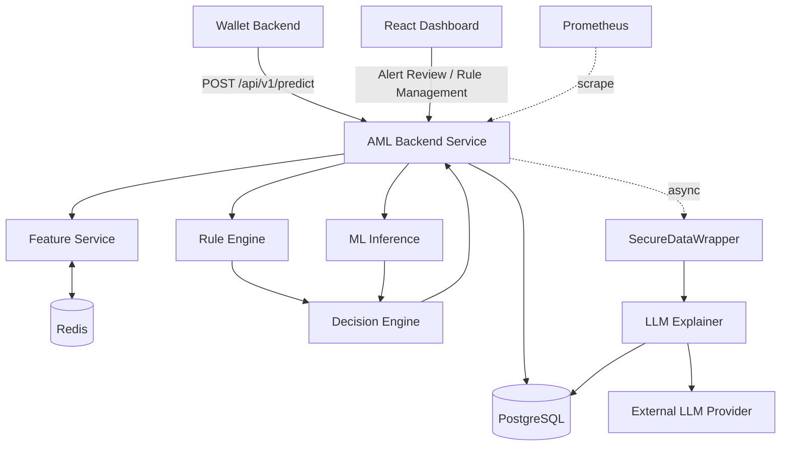
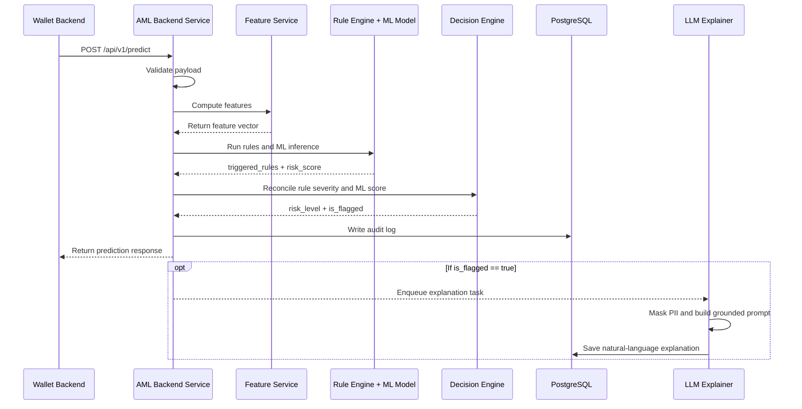

# AnomalyX - Transaction Anomaly Detector (AML) Prototype

AnomalyX is an Anti-Money Laundering (AML) transaction anomaly detection prototype designed for digital wallet systems. The system combines a rule-based engine, a machine learning classifier, and an LLM-based explanation layer to detect suspicious transactions and provide clear, human-readable explanations for compliance review.

The project is developed as part of the Internship 2026 program and focuses on validating an end-to-end AML detection workflow using synthetic / benchmark transaction data.

---

## 1. Project Overview

Money laundering detection is challenging because suspicious transactions are rare, patterns constantly change, and compliance teams require explainable alerts rather than black-box predictions.

AnomalyX addresses this problem by using a hybrid detection approach:

* **Rule Engine**: Detects known AML patterns such as structuring, smurfing, rapid movement, threshold avoidance, and layering.
* **Machine Learning Model**: Detects complex or uncodified anomalous transaction behavior.
* **Decision Engine**: Combines rule severity and ML risk score into a final risk level.
* **LLM Explainer**: Generates natural-language explanations for flagged alerts.
* **Compliance Dashboard**: Allows users to review alerts, inspect explanations, and update alert status.

---

## 2. Key Features

### Real-time Transaction Scoring

The Wallet Backend Service can call the prediction API to evaluate a transaction before or during the transaction processing flow.

The system returns:

* `risk_score`
* `risk_level`
* `is_flagged`
* triggered AML rules
* top contributing features
* alert explanation if available

### Batch Scoring

Compliance Officers can run batch scoring over historical transactions to detect suspicious patterns that may not be obvious in a single real-time transaction.

### LLM-based Alert Explanation

For flagged transactions, the system generates a natural-language explanation based on:

* triggered rule IDs
* rule severity
* top SHAP features
* transaction risk level
* decision result

The explanation is generated asynchronously so that the main prediction API remains fast.

### Alert Review Workflow

Compliance Officers can update alert status:

* `NEW`
* `ESCALATED`
* `DISMISSED`

These review actions create feedback labels that can later be used for model retraining.

### Rule Configuration Hot Reload

ML/Risk Engineers can update AML detection rules through YAML/JSON configuration files without redeploying the entire system.

### Monitoring and Metrics

The system exposes health and performance metrics for monitoring:

* request count
* request latency
* alert rate
* rule trigger count
* LLM fallback count
* model drift indicators

---

## 3. System Actors

| Actor                  | Description                                                                         |
| ---------------------- | ----------------------------------------------------------------------------------- |
| Compliance Officer     | Reviews alerts, reads explanations, escalates or dismisses suspicious transactions. |
| Wallet Backend Service | Sends transaction data to the AML API and receives risk decisions.                  |
| ML/Risk Engineer       | Updates rules, monitors model metrics, and maintains ML pipeline quality.           |
| LLM Provider           | External service used to generate natural-language explanations.                    |

---

## 4. System Architecture

AnomalyX follows a layered hybrid architecture.



### Main Components

| Component           | Responsibility                                                                        | Technology               |
| ------------------- | ------------------------------------------------------------------------------------- | ------------------------ |
| AML Backend Service | API routing, request validation, authentication, prediction orchestration, alert CRUD | FastAPI, Uvicorn         |
| Presentation Layer  | Compliance dashboard for reviewing alerts and explanations                            | ReactJS                  |
| Feature Service     | Computes transaction, velocity, behavioral, and sequence features                     | Python, Redis            |
| Rule Engine         | Evaluates YAML/JSON AML rules using a safe DSL                                        | YAML, Python             |
| ML Inference        | Loads trained model and returns risk score + SHAP explanation features                | XGBoost / LightGBM, SHAP |
| Decision Engine     | Combines rule result and ML score into final risk level                               | Python                   |
| LLM Explainer       | Generates bilingual natural-language alert explanation                                | OpenAI / Claude API      |
| Data Layer          | Stores alerts, labels, feature snapshots, model registry, rule versions               | PostgreSQL, Redis        |
| Monitoring          | Tracks API health, latency, rule triggers, drift, and system metrics                  | Prometheus               |

---

## 5. Real-time Scoring Flow



The LLM explanation branch runs asynchronously. This ensures the prediction response is not blocked by the external LLM API.

---

## 6. Decision Logic

The Decision Engine combines deterministic rule outputs and probabilistic ML outputs.

| Rule Engine Output      |               ML Risk Score | Final Risk Level | Flagged |
| ----------------------- | --------------------------: | ---------------- | ------- |
| CRITICAL rule triggered |                   Any score | CRITICAL         | Yes     |
| HIGH rule triggered     |                   Any score | HIGH             | Yes     |
| None or MINOR rule      |        `risk_score >= 0.70` | HIGH             | Yes     |
| MINOR rule triggered    | `0.40 <= risk_score < 0.70` | MEDIUM           | No      |
| None                    | `0.40 <= risk_score < 0.70` | MEDIUM           | No      |
| None or MINOR rule      |         `risk_score < 0.40` | LOW              | No      |

The thresholds are configurable and can be calibrated by the Risk/Data Science team.

---

## 7. AML Patterns Covered

AnomalyX is designed to detect several common AML typologies:

| Pattern              | Description                                                                   |
| -------------------- | ----------------------------------------------------------------------------- |
| Structuring          | Splitting large transactions into smaller ones to avoid reporting thresholds. |
| Smurfing             | Using multiple accounts to disperse funds.                                    |
| Rapid Movement       | Moving funds quickly across accounts or wallets.                              |
| Layering             | Passing funds through multiple intermediary accounts to hide the source.      |
| Threshold Avoidance  | Sending transactions just below regulatory or internal thresholds.            |
| Velocity Anomaly     | Unusual transaction frequency or amount compared with user history.           |
| Geo / Device Anomaly | Suspicious behavior from new devices or impossible travel patterns.           |

---

## 8. Machine Learning Pipeline

The ML pipeline is designed for supervised binary classification: suspicious vs. legitimate transactions.

### Pipeline Stages

```text
generate / load data
        ↓
validate data
        ↓
feature extraction
        ↓
train / validation / test split
        ↓
preprocessing
        ↓
model training
        ↓
evaluation
        ↓
calibration
        ↓
serialization
        ↓
model registry
```

### Models

The project uses:

* **Logistic Regression** as an interpretable baseline.
* **XGBoost / LightGBM** as the primary model for tabular transaction anomaly detection.

### Explainability

The ML model uses SHAP to identify the top contributing features for each prediction. These features are included in the alert payload and used by the LLM Explainer.

---

## 9. Data Design

### Transaction Input Schema

Example request payload:

```json
{
  "transaction_id": "8f1c...e9",
  "sender_id": "h:3a9f...",
  "receiver_id": "h:7b2c...",
  "sender_balance": 15000000,
  "receiver_balance": 200000,
  "amount": 9500000,
  "currency": "VND",
  "timestamp": "2026-05-30T09:14:03+07:00",
  "channel": "TRANSFER"
}
```

### Privacy Principles

The system follows strict privacy and PII protection rules:

* No raw PII is stored.
* Sender and receiver identifiers are hashed or pseudonymized.
* Logs contain only hashed IDs, transaction IDs, and prediction results.
* External LLM providers receive only masked or non-PII context.
* API keys and secrets must be stored in environment variables, not in source code.

---

## 10. API Overview

Base path:

```text
/api/v1
```

### Main Endpoints

| Method | Endpoint                    | Description                              |
| ------ | --------------------------- | ---------------------------------------- |
| POST   | `/predict`                  | Score a single transaction in real time. |
| POST   | `/batch-score`              | Score a batch of transactions.           |
| GET    | `/alerts`                   | Retrieve generated alerts.               |
| GET    | `/alerts/{alert_id}`        | View alert details.                      |
| PATCH  | `/alerts/{alert_id}/status` | Update alert status.                     |
| POST   | `/rules/reload`             | Reload AML rule configuration.           |
| GET    | `/health`                   | Check service health.                    |
| GET    | `/metrics`                  | Expose Prometheus metrics.               |

### Example Prediction Response

```json
{
  "transaction_id": "8f1c...e9",
  "risk_score": 0.82,
  "risk_level": "HIGH",
  "is_flagged": true,
  "triggered_rules": [
    {
      "rule_id": "R-STRUCT-01",
      "severity": "HIGH",
      "typology": "structuring"
    }
  ],
  "top_features": [
    {
      "name": "count_just_below_threshold_24h",
      "value": 4,
      "contribution": 0.31
    },
    {
      "name": "amount_to_threshold_ratio",
      "value": 0.96,
      "contribution": 0.24
    }
  ],
  "explanation_source": "llm"
}
```

---

## 11. Tech Stack

| Layer                      | Technology                        |
| -------------------------- | --------------------------------- |
| Backend API                | FastAPI, Uvicorn                  |
| Frontend                   | ReactJS, Vite                     |
| Database                   | PostgreSQL                        |
| Cache / Rolling Aggregates | Redis                             |
| ML Model                   | XGBoost / LightGBM                |
| Explainability             | SHAP                              |
| LLM Integration            | OpenAI API / Claude API           |
| Monitoring                 | Prometheus                        |
| Containerization           | Docker, Docker Compose            |
| Testing                    | pytest, schemathesis, k6 / Locust |

---

## 12. Project Structure

Suggested repository structure:

```text
anomalyx/
├── backend/
│   ├── app/
│   │   ├── api/
│   │   ├── core/
│   │   ├── features/
│   │   ├── rules/
│   │   ├── ml/
│   │   ├── llm/
│   │   ├── db/
│   │   └── main.py
│   ├── tests/
│   ├── requirements.txt
│   └── Dockerfile
│
├── frontend/
│   ├── src/
│   ├── public/
│   ├── package.json
│   └── Dockerfile
│
├── ml_pipeline/
│   ├── data/
│   ├── notebooks/
│   ├── training/
│   ├── evaluation/
│   └── model_registry/
│
├── configs/
│   ├── rules.yaml
│   └── model_config.yaml
│
├── monitoring/
│   └── prometheus.yml
│
├── docker-compose.yml
├── .env.example
├── Makefile
└── README.md
```

---

## 13. Getting Started

### Prerequisites

Make sure the following tools are installed:

* Docker
* Docker Compose
* Python 3.10+
* Node.js 18+
* PostgreSQL client, optional
* Redis client, optional

---

## 14. Environment Variables

Create a `.env` file from the example file:

```bash
cp .env.example .env
```

Example `.env` values:

```env
APP_ENV=development
API_PORT=8000

POSTGRES_HOST=postgres
POSTGRES_PORT=5432
POSTGRES_DB=anomalyx
POSTGRES_USER=anomalyx_user
POSTGRES_PASSWORD=anomalyx_password

REDIS_HOST=redis
REDIS_PORT=6379

JWT_SECRET=change_me

LLM_PROVIDER=openai
OPENAI_API_KEY=your_api_key_here
ANTHROPIC_API_KEY=your_api_key_here

RISK_THRESHOLD_MEDIUM=0.40
RISK_THRESHOLD_HIGH=0.70
```

Do not commit `.env` to GitHub.

---

## 15. Run with Docker Compose

Start all services:

```bash
docker-compose up --build
```

After startup:

```text
Backend API:        http://localhost:8000
Frontend Dashboard: http://localhost:5173
API Docs:           http://localhost:8000/docs
Prometheus:         http://localhost:9090
```

Stop services:

```bash
docker-compose down
```

---

## 16. Run Backend Locally

```bash
cd backend
python -m venv .venv
source .venv/bin/activate
pip install -r requirements.txt
uvicorn app.main:app --reload --port 8000
```

For Windows PowerShell:

```powershell
cd backend
python -m venv .venv
.venv\Scripts\Activate.ps1
pip install -r requirements.txt
uvicorn app.main:app --reload --port 8000
```

---

## 17. Run Frontend Locally

```bash
cd frontend
npm install
npm run dev
```

---

## 18. Example API Request

```bash
curl -X POST "http://localhost:8000/api/v1/predict" \
  -H "Content-Type: application/json" \
  -H "Authorization: Bearer <your_token>" \
  -d '{
    "transaction_id": "8f1c-example",
    "sender_id": "h:sender001",
    "receiver_id": "h:receiver001",
    "sender_balance": 15000000,
    "receiver_balance": 200000,
    "amount": 9500000,
    "currency": "VND",
    "timestamp": "2026-05-30T09:14:03+07:00",
    "channel": "TRANSFER"
  }'
```

---

## 19. Testing

Run backend tests:

```bash
cd backend
pytest
```

Run API contract tests:

```bash
schemathesis run http://localhost:8000/openapi.json
```

Run performance test:

```bash
k6 run tests/performance/predict_load_test.js
```

or:

```bash
locust -f tests/performance/locustfile.py
```

Target testing goals:

* Unit test core modules.
* Integration test API + PostgreSQL + Redis + ML model.
* End-to-end test transaction scoring to alert review.
* Validate rule coverage for each AML typology.
* Ensure API p95 latency remains under 500 ms excluding LLM calls.
* Maintain at least 70% test coverage across core modules.

---

## 20. Success Metrics

### Model Metrics

| Metric                     |  Target |
| -------------------------- | ------: |
| Precision suspicious class | >= 0.70 |
| Recall suspicious class    | >= 0.60 |
| F1 suspicious class        | >= 0.65 |
| AUC-ROC                    | >= 0.85 |
| AUC-PR                     | >= 0.50 |
| False positive rate        |   <= 5% |

### Rule Engine Metrics

| Metric                   |                                        Target |
| ------------------------ | --------------------------------------------: |
| Number of deployed rules |                                          >= 6 |
| Rule coverage            | Each AML pattern covered by at least one rule |
| Rule false positive rate |                                         <= 8% |

### Service Metrics

| Metric                               |                  Target |
| ------------------------------------ | ----------------------: |
| p95 `/predict` latency excluding LLM |               <= 500 ms |
| p95 latency with LLM explanation     |            <= 3 seconds |
| Single-instance throughput           | >= 50 requests / second |
| Test coverage                        |                  >= 70% |

---

## 21. Security and Privacy

AnomalyX is designed with privacy and security as core requirements.

Security principles:

* No raw PII in logs.
* Hashed or masked sender and receiver IDs.
* JWT required for private endpoints.
* External secrets loaded from `.env`.
* No hardcoded API keys.
* LLM prompts contain only non-PII and grounded context.
* Failed LLM calls fall back to deterministic template explanations.

---

## 22. LLM Explanation Guardrails

The LLM Explainer must only explain based on provided system evidence.

Allowed context:

* triggered rule IDs
* rule severity
* risk score
* risk level
* top contributing SHAP features
* transaction metadata without PII

If the LLM response introduces unsupported details, the system rejects it and falls back to a template explanation.

---

## 23. Roadmap

### Phase 1: Product and Requirement Definition

* Define project scope.
* Identify AML use cases.
* Define actors and functional requirements.
* Define success metrics and risks.

### Phase 2: Technical Design

* Design system architecture.
* Define API contracts.
* Design rule engine and ML pipeline.
* Define data schema and privacy model.

### Phase 3: Core Implementation

* Implement backend API.
* Implement feature service.
* Implement rule engine.
* Train baseline and primary ML models.
* Implement decision engine.

### Phase 4: Dashboard and Explanation

* Build Compliance Officer dashboard.
* Implement alert list and alert detail page.
* Integrate LLM Explainer.
* Add explanation fallback template.

### Phase 5: Testing and Evaluation

* Run unit, integration, and end-to-end tests.
* Evaluate model metrics.
* Test latency and throughput.
* Review LLM explanation quality.

### Phase 6: Final Demo

* Demonstrate real-time scoring.
* Demonstrate batch scoring.
* Demonstrate alert explanation.
* Demonstrate rule hot reload.
* Present metrics and limitations.

---

## 24. Known Limitations

This project is a prototype and has several limitations:

* It does not process real e-wallet production data.
* It does not submit actual Suspicious Transaction Reports to authorities.
* It does not implement full production-grade CI/CD.
* It does not provide production-scale streaming by default.
* Model quality depends heavily on the synthetic or benchmark dataset.
* LLM explanation quality depends on prompt grounding and provider reliability.

---

## 25. Team

| Member            | Student ID  |
| ----------------- | ----------- |
| Phạm Lê Hoàng Nam | 2A202600416 |
| Đinh Thái Tuấn    | 2A202600360 |
| Nguyễn Trọng Tín  | 2A202600229 |

### Mentors

| Role            | Name              |
| --------------- | ----------------- |
| Mentor          | Trần Quang Hiển   |
| External Mentor | Phan Công Huân    |
| External Mentor | Nguyễn Nam Trường |

---

## 26. References

* Law on Anti-Money Laundering No. 14/2022/QH15
* FATF Recommendations
* PaySim synthetic financial dataset
* IBM Anti-Money Laundering Synthetic Dataset
* Internship 2026 Handbook

---

## 27. License

This project is developed for educational and prototype demonstration purposes. Please update this section with the appropriate license before publishing the repository.
