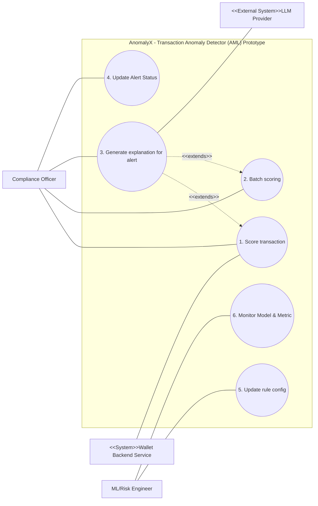

VINUNIVERSITY logo

VIN SMART FUTURE logo

# ANOMALYX - TRANSACTION ANOMALY DETECTOR (AML) PROTOTYPE

Product Requirement Document

<table>
  <thead>
    <tr>
        <th colspan="2">AnomalyX Team</th>
    </tr>
  </thead>
  <tbody>
    <tr>
        <td><strong>Group members</strong></td>
        <td>Phạm Lê Hoàng Nam - 2A202600416 Đinh Thái Tuấn - 2A202600360 Nguyễn Trọng Tín - 2A202600229</td>
    </tr>
    <tr>
        <td><strong>Mentor</strong></td>
        <td>Trần Quang Hiển (VSF-FINTECH-VDTDVTC)</td>
    </tr>
    <tr>
        <td><strong>Ext Mentor</strong></td>
        <td>Phan Công Huân (VSF-FINTECH-VDTDVTC) Nguyễn Nam Trường (VSF-FINTECH-VDTDVTC)</td>
    </tr>
  </tbody>
</table>

1 | Page

– HaNoi, May 2026 –

# Table of Contents

I. Record of Changes

II. Product Requirement Document

1. Product Introduction

1.1. Executive Summary

1.2. Background & Problem Statement

1.2.1 AML Context

1.2.2 Legal Requirements

1.2.3 Technical Challenges

1.2.4 Prototype Value

- 1.2.5 Scope & Objectives

2. Product Overview

3. User Requirements

3.1 Actors

3.2 Use Cases

3.2.1 Diagram(s)

3.2.2 Use Case Descriptions

4. Functional Requirements

4.1 Core System Features

4.1.1 - Score transaction

4.1.2 - Batch scoring

4.1.3 - Generate explanation for alert

4.1.4 - Update Alert Status

4.1.5 - Update rule config

- 4.1.6 - Monitor Model & Metrics

5. Non-Functional Requirements

5.1. External Interfaces

5.1.1 User Interface

5.1.2 Software Interface

5.1.3 Hardware Interface

5.2. Quality Attributes

- 5.2.1 Performance & Scalability

- 5.2.2 Reliability & Robustness

- 5.2.3 Security & Privacy

5.2.4 Explainability

- 5.2.5 Maintainability & Reproducibility

6. Success Metrics

6.1 Model Metrics

6.2 Rule engine metrics

2 | Page

6.3 Service metrics

6.4 LLM explanation quality

7. Data Requirements

7.1 Dataset

7.2 Scale and Schema

7.3 AML Patterns to Inject into Synthetic Data

7.4 Privacy & PII

8. Architecture Overview (High-Level)

8.1 Components

8.2 Tech Stack

9. Milestones & Timeline

10. Risks & Mitigations

11. Appendix

11.1 Glossary

11.2 References

12. Open Questions

**List of Tables**

Table 1. Record of Change

Table 2. All Actors in the System

Table 3. Use Case Description

Table 4. Model Metrics

Table 5. Scale and Schema

Table 6. Tech Stack

Table 7. Milestones & Timeline

Table 8. Risks & Mitigations

Table 9. Glossary

**List of Figures**

Figure 1. Money Laundering Cycle (source: UN - Money Laundering)

Figure 2. Hybrid AML Architecture: Integrating Rule Engine, ML, and LLM

Figure 3. Context Diagram

Figure 4. AnomalyX Usecase Diagram

3 | Page

# I. Record of Changes

*A - Added M - Modified D - Deleted

<table>
  <thead>
    <tr>
        <th>Date</th>
        <th>A* M, D</th>
        <th>In charge</th>
        <th>Change Description</th>
    </tr>
  </thead>
  <tbody>
    <tr>
        <td>27/05/2026</td>
        <td>A</td>
        <td>NamPLH</td>
        <td>Init base document</td>
    </tr>
    <tr>
        <td>28/05/2026</td>
        <td>A</td>
        <td>All members</td>
        <td>Add Product Overview, Personas, Use case,...</td>
    </tr>
    <tr>
        <td>29/05/2026</td>
        <td>M</td>
        <td>All members</td>
        <td>Complete document</td>
    </tr>
    <tr>
        <td> </td>
        <td> </td>
        <td> </td>
        <td> </td>
    </tr>
    <tr>
        <td> </td>
        <td> </td>
        <td> </td>
        <td> </td>
    </tr>
    <tr>
        <td> </td>
        <td> </td>
        <td> </td>
        <td> </td>
    </tr>
    <tr>
        <td> </td>
        <td> </td>
        <td> </td>
        <td> </td>
    </tr>
    <tr>
        <td> </td>
        <td> </td>
        <td> </td>
        <td> </td>
    </tr>
    <tr>
        <td> </td>
        <td> </td>
        <td> </td>
        <td> </td>
    </tr>
    <tr>
        <td> </td>
        <td> </td>
        <td> </td>
        <td> </td>
    </tr>
    <tr>
        <td> </td>
        <td> </td>
        <td> </td>
        <td> </td>
    </tr>
    <tr>
        <td> </td>
        <td> </td>
        <td> </td>
        <td> </td>
    </tr>
    <tr>
        <td> </td>
        <td> </td>
        <td> </td>
        <td> </td>
    </tr>
    <tr>
        <td> </td>
        <td> </td>
        <td> </td>
        <td> </td>
    </tr>
  </tbody>
</table>

Table 1. Record of Change

4 | Page

# II. Product Requirement Document

**1. Product Introduction**

**1.1. Executive Summary**

This document defines the product requirements for the *Transaction Anomaly Detector prototype*—an AML (Anti-Money-Laundering) engine capable of integrating into a digital wallet system. The prototype combines a rule-based engine and a Machine Learning classifier to detect suspicious transactions, while using LLM to generate natural language explanations for each alert.

The project is carried out over **6 weeks** as part of the **Internship 2026 program**. The final product is a service prototype packaged in Docker, with a clear API, capable of an end-to-end demo on a synthetic dataset, accompanied by complete technical documentation and a test report with quality evaluation metrics.

### 1.2. Background & Problem Statement

**1.2.1 AML Context**

Money laundering is the process of legitimizing funds obtained from illegal sources through financial transactions. A typical process includes three stages: **placement** (introducing illicit funds into the system), **layering** (concealing origins through multiple intermediary transactions), and **integration** (emerging funds into the legal economy). In the Vietnamese e-wallet environment, common patterns include:

*   Structuring: Splitting transactions to avoid the CTR reporting threshold.

*   Smurfing: Using multiple accounts to disperse funds.

*   Rapid movement: Quickly transferring money across multiple wallets.

*   Threshold avoidance: Conducting transactions just below regulatory limits.

Money Laundering Cycle

<table>
  <caption>Figure 1. Money Laundering Cycle (source: UN - Money Laundering)</caption>
  <thead>
    <tr>
      <th>Stage</th>
      <th>Input/Source</th>
      <th>Process/Activities</th>
      <th>Outcome/Destination</th>
    </tr>
  </thead>
  <tbody>
    <tr>
      <th>PLACEMENT</th>
      <td>Collection of dirty money</td>
      <td>Movement of illicit funds into the financial system</td>
      <td>Dirty Money integrates into the Financial System</td>
    </tr>
    <tr>
      <th>LAYERING</th>
      <td>Funds within the financial system</td>
      <td>
        <ul>
          <li>Payment by "Y" of false invoice to company "X"</li>
          <li>Transfer on the bank account of company "X"</li>
          <li>Offshore Bank transactions</li>
          <li>Loan to company "Y"</li>
        </ul>
      </td>
      <td>Obscured origin of funds through complex layers</td>
    </tr>
    <tr>
      <th>INTEGRATION</th>
      <td>Layered funds</td>
      <td>
        <ul>
          <li>Purchase of Luxury Assets</li>
          <li>Financial Investments</li>
          <li>Commercial/Industrial Investments</li>
        </ul>
      </td>
      <td>Funds appear as legitimate wealth in the economy</td>
    </tr>
  </tbody>
</table>

<u>Figure 1. Money Laundering Cycle (source: UN - Money Laundering)</u>

**1.2.2 Legal Requirements**

Under the **AML/CFT regulations of the State Bank of Vietnam** (Anti-Money-Laundering Law 2022 and related guidance documents), financial institutions are required to maintain transaction monitoring systems and report suspicious transactions (**STRs**).

5 | Page

**1.2.3 Technical Challenges**

Detecting money laundering transactions is particularly difficult due to:

* **Extreme class imbalance:** True laundering cases often account for less than 0.1%, making traditional ML approaches ineffective.

* **Lack of ground truth labels:** Many laundering cases are never confirmed, leading to high label noise.

* **Adversarial behavior:** Criminals continuously adapt patterns once detection systems are identified.

* **High false positive rate:** Causes resource strain for compliance investigation teams.

* **High explainability requirements:** Alerts must include clear reasoning due to legal implications.

**1.2.4 Prototype Value**

The prototype addresses the end-to-end AML detection problem at a small scale using synthetic data, enabling validation of the hybrid architecture (rule + ML + LLM) before investing in a production system. This approach mirrors industry best practices:

* The **rule engine** captures known patterns with high precision.

* The **ML model** detects complex, uncodified patterns.

* The **LLM layer** provides natural-language explanations to reduce investigation time.

Diagram of Hybrid AML Architecture showing Synthetic Transaction Data flowing into a Rule-Based Engine and ML Model, which then feed into an LLM Layer to generate alerts with natural language reasons.

Figure 2. Hybrid AML Architecture: Integrating Rule Engine, ML, and LLM

## 1.2.5 Scope & Objectives

**In-scope (Project Objectives):**

* Build an ML pipeline to detect anomalous transactions with precision and recall meeting target thresholds on a synthetic dataset.

* Integrate a configurable **rule engine (YAML/JSON)** to capture known AML patterns (structuring, smurfing, rapid movement, threshold avoidance).

* Generate alerts with **LLM-based natural explanations** to help compliance officers understand flagged transactions.

* Simulate integration flow into an e-wallet system via **mock APIs**.

### Out-of-scope:

* Development of a real transaction processing system.

* Full production deployment or CI/CD pipeline implementation.

* Actual reporting to regulatory authorities (FIU, SBV) — only simulated output formats.

* Real-time streaming at production scale (stretch goal only).

* Processing of real e-wallet data — all datasets are synthetic.

6 | Page

**2. Product Overview**

AnomalyX is a specialized **Anti-Money Laundering (AML) prototype** designed for e-wallet systems. It utilizes a hybrid architecture, combining a rule-based engine to catch known money laundering patterns with a Machine Learning classifier to detect complex, uncodified anomalies. To ensure high explainability, the system integrates a Large Language Model (LLM) that automatically generates natural-language reasons for every flagged alert. This proof-of-concept validates the end-to-end detection workflow on synthetic data, helping compliance teams significantly reduce manual investigation time while meeting strict regulatory standards.

<table>
  <caption>3.1 Actors and Figure 3. Context Diagram Data</caption>
  <thead>
    <tr>
      <th colspan="3">3.1 Actors</th>
    </tr>
    <tr>
      <th>#</th>
      <th>Actor</th>
      <th>Description</th>
    </tr>
  </thead>
  <tbody>
    <tr>
      <td>1</td>
      <td>Compliance Officer (Primary Human)</td>
      <td>The primary user of the system, responsible for reviewing alerts generated by the system and deciding whether to escalate or dismiss them. They expect alerts to include clear risk scores, natural-language explanations, and a list of triggered rules and features.</td>
    </tr>
    <tr>
      <td>2</td>
      <td>Wallet Backend Service (System User)</td>
      <td>A system actor that calls the AML API to evaluate risk prior to confirming a transaction. It requires low latency to ensure the e-wallet's user experience is not impacted, along with standard JSON formatted responses and idempotency.</td>
    </tr>
    <tr>
      <td>3</td>
      <td>ML/Risk Engineer (Operator/Human)</td>
      <td>The system operator is tasked with monitoring model performance, retraining models when necessary, and updating rule configurations. They expect a clear pipeline, a model card, and comprehensive system logs.</td>
    </tr>
    <tr>
      <td>4</td>
      <td>LLM Provider (External System)</td>
      <td>An external system actor (such as the API for OpenAI, Anthropic, or a local model) that provides large language model services. The AML system calls this actor to automatically generate a natural-language explanation for each alert based on the triggered rules and top contributing features.</td>
    </tr>
    <tr>
      <th colspan="3">Figure 3. Context Diagram: System Data Flows</th>
    </tr>
    <tr>
      <th>Source</th>
      <th>Destination</th>
      <th>Data/Action Label</th>
    </tr>
    <tr>
      <td>Wallet Backend Service</td>
      <td>ANOMALYX TRANSACTION ANOMALY DETECTOR (AML) PROTOTYPE</td>
      <td>Send real-time transaction data</td>
    </tr>
    <tr>
      <td>ANOMALYX TRANSACTION ANOMALY DETECTOR (AML) PROTOTYPE</td>
      <td>Wallet Backend Service</td>
      <td>Decision &amp; risk score</td>
    </tr>
    <tr>
      <td>ML/Risk Engineer</td>
      <td>ANOMALYX TRANSACTION ANOMALY DETECTOR (AML) PROTOTYPE</td>
      <td>Updates YAML/JSON rule configs &amp; monitors model</td>
    </tr>
    <tr>
      <td>ANOMALYX TRANSACTION ANOMALY DETECTOR (AML) PROTOTYPE</td>
      <td>LLM Provider</td>
      <td>Sends infomation, triggered rules/features</td>
    </tr>
    <tr>
      <td>LLM Provider</td>
      <td>ANOMALYX TRANSACTION ANOMALY DETECTOR (AML) PROTOTYPE</td>
      <td>Natural-language explanation</td>
    </tr>
    <tr>
      <td>ANOMALYX TRANSACTION ANOMALY DETECTOR (AML) PROTOTYPE</td>
      <td>Compliance Officer</td>
      <td>Alerts with natural-language explanations</td>
    </tr>
    <tr>
      <td>Compliance Officer</td>
      <td>ANOMALYX TRANSACTION ANOMALY DETECTOR (AML) PROTOTYPE</td>
      <td>Reviews and decides to escalate or dismiss</td>
    </tr>
  </tbody>
</table>

Figure 3. Context Diagram

**3. User Requirements**

**3.1 Actors**

<table>
  <thead>
    <tr>
        <th>#</th>
        <th>Actor</th>
        <th>Description</th>
    </tr>
  </thead>
  <tbody>
    <tr>
        <td>1</td>
        <td><strong>Compliance Officer</strong> <em>(Primary Human)</em></td>
        <td>The primary user of the system, responsible for reviewing alerts generated by the system and deciding whether to escalate or dismiss them. They expect alerts to include clear risk scores, natural-language explanations, and a list of triggered rules and features.</td>
    </tr>
    <tr>
        <td>2</td>
        <td><strong>Wallet Backend Service</strong> <em>(System User)</em></td>
        <td>A system actor that calls the AML API to evaluate risk prior to confirming a transaction. It requires low latency to ensure the e-wallet's user experience is not impacted, along with standard JSON formatted responses and idempotency.</td>
    </tr>
    <tr>
        <td>3</td>
        <td><strong>ML/Risk Engineer</strong> <em>(Operator/Human)</em></td>
        <td>The system operator is tasked with monitoring model performance, retraining models when necessary, and updating rule configurations. They expect a clear pipeline, a model card, and comprehensive system logs.</td>
    </tr>
    <tr>
        <td>4</td>
        <td><strong>LLM Provider</strong> <em>(External System)</em></td>
        <td>An external system actor (such as the API for OpenAI, Anthropic, or a local model) that provides large language model services. The AML system calls this actor to automatically generate a natural-language explanation for each alert based on the triggered rules and top contributing features.</td>
    </tr>
  </tbody>
</table>

7 | Page

Table 2. All Actors in the System

**3.2 Use Cases**

**3.2.1 Diagram(s)**

Figure 4. AnomalyX Usecase Diagram

**3.2.2 Use Case Descriptions**

<table>
  <thead>
    <tr>
        <th>ID</th>
        <th>Use Case</th>
        <th>Actors</th>
        <th>Use Case Description</th>
    </tr>
  </thead>
  <tbody>
    <tr>
        <td>01</td>
        <td>Score transaction</td>
        <td>Wallet Backend Service, Compliance Officer</td>
        <td>- Evaluates the risk of a transaction in real-time. - Main flow: The wallet backend calls <mark>POST /api/predict</mark> with the transaction payload. The system extracts features, runs the Rule engine and ML model to calculate a risk score from 0-1. If the threshold is exceeded, it generates an alert with an LLM explanation. It returns the decision (ALLOW / FLAG / BLOCK) and logs the result for the audit trail.</td>
    </tr>
  </tbody>
</table>

8 | Page

<table>
  <tbody>
    <tr>
        <td>02</td>
        <td>Batch scoring</td>
        <td>Compliance Officer</td>
        <td>- Scores a batch of transactions over a specific time period (e.g., daily) via a dashboard or script. - To identify anomalous cases that the real-time processing flow might have missed.</td>
    </tr>
    <tr>
        <td>03</td>
        <td>Generate explanation for alert</td>
        <td>Compliance Officer, LLM Provider</td>
        <td>- Provides a natural-language explanation (in English/Vietnamese) for each alert. - Clearly states which rules were triggered, which features contributed most to the risk score, and any similar historical patterns (if applicable).</td>
    </tr>
    <tr>
        <td>04</td>
        <td>Update Alert Status</td>
        <td>Compliance Officer</td>
        <td>- After reviewing the alert and reading the system's explanation, the user decides on an action to take (Escalate for risk reporting, or Dismiss if it is a False Positive). - This action closes the operational loop and generates ground-truth labels for the ML/Risk Engineer to use for future model retraining.</td>
    </tr>
    <tr>
        <td>05</td>
        <td>Update rule config</td>
        <td>ML/Risk Engineer</td>
        <td>- Edits rules in the YAML/JSON configuration file and reloads the service without requiring a full redeployment. This enables the system to rapidly adopt new AML rules.</td>
    </tr>
    <tr>
        <td>06</td>
        <td>Monitor Model &amp; Metrics</td>
        <td>ML/Risk Engineer</td>
        <td>- Tracks system and model health via `/health`, `/metrics` endpoints, or an admin Dashboard. - Resource indicators (request count, latency histogram), alert rate, and model performance degradation (model drift) over time.</td>
    </tr>
  </tbody>
</table>

Table 3. Use Case Description

# 4. Functional Requirements

4.1 Core System Features

4.1.1 - Score transaction

*   *Function trigger:* The Wallet Backend Service invokes the `/api/predict` API to perform a risk assessment before approving and executing a transaction.

9 | Page

- ***Function detail:***
- ***Functionality*** *:

In Normal Cases:*

- ***Function description:*** To assess the risk level of a transaction in real time and detect potential money laundering activities.

  - **Data Validation** : The request payload must be in valid JSON format and include all required fields (e.g., transaction\_id, sender\_id, receiver\_id, amount, timestamp, and channel).

    - ––––––––––––––––––––––––––––––––––––––––––––––––––––––––––––––––––––––––––––––––––-

      - *In Abnormal Cases:*

      - The Wallet Backend Service sends a transaction request to the API.

      - The system extracts relevant features from the transaction data and historical user activity.

      - The system executes the Rule Engine to evaluate predefined AML rules and passes the extracted features to the ML model to calculate a risk score (ranging from 0 to 1).

      - If the risk score exceeds the configured threshold or any critical AML rule is triggered, the system invokes the LLM to generate a human-readable explanation.

      - The system returns a decision of **ALLOW** , **FLAG** , or **BLOCK** , along with the corresponding explanation.

    - All evaluation results, decisions, and explanations are recorded in the audit trail for monitoring, compliance, and investigation purposes.

      - Payload Validation Error: Return HTTP 400 (Bad Request) with detailed validation error information.

      - LLM Service Unavailable: The system continues processing and returns the prediction result and triggered rule codes without the natural-language explanation.

## *4.1.2 - Batch scoring*

- ***Function trigger:*** The Compliance Officer manually initiates the feature through the Administration Dashboard, or the system automatically executes it based on a predefined schedule (e.g., end-of-day or end-of-week batch processing).
- ***Function description:*** Performs risk assessment on a batch of transactions within a specified time period to identify complex money laundering patterns and suspicious behaviors that may not be detected during real-time transaction screening.
- ***Function detail :***

10 | Page
<page_number>10</page_number>

*○ Functionality:

In Normal Cases:*

*○ Data Validation:* The input transaction dataset must conform to the system-defined schema, and the requested time range must be valid and within the allowed query limits.

––––––––––––––––––––––––––––––––––––––––––––––––––––––––––––––––––––––––––––––––––-

***4.1.3 - Generate explanation for alert***

––––––––––––––––––––––––––––––––––––––––––––––––––––––––––––––––––––––––––––––––––-

***4.1.4 - Update Alert Status***

*■*

  - *■ ●*

  - ***Function trigger:*** The system is automatically triggered when a transaction is marked as suspicious (FLAG or BLOCK), or when a Compliance Officer opens and reviews the details of an alert.

    - ***Function description:*** Provides a natural-language explanation (Vietnamese or English) for each alert, enabling users to understand why a transaction was flagged and which risk factors contributed to the decision.

      - ***Function detail :***

*○ Functionality:*

***Function trigger:*** The Compliance Officer clicks an action button (e.g., Escalate, Dismiss) after reviewing an alert on the Dashboard.

      - The system retrieves all transactions within the specified time window.

      - The system applies the Rule Engine and ML Model to evaluate risk across the entire transaction dataset.

      - Suspicious transactions are aggregated into an Alert List based on their risk scores and triggered AML rules.

      - The Alert List is displayed on the Compliance Dashboard for further investigation and review.

*In Normal Cases:*

      - The system retrieves information about the violated rules and the features that contributed most significantly to the risk score.

      - The system sends this contextual data to an external LLM Provider.

- The system receives a natural-language explanation from the LLM describing the reasons why the alert was triggered and displays it on the Alert Details screen.

*In Abnormal Cases:* If the LLM returns an error or exceeds the response timeout, the system falls back to predefined template messages and displays the list of triggered rule codes instead of a natural-language explanation.

11 | Page
<page_number>11</page_number>

- ***Function detail:***

*○ Functionality:

In Normal Cases:*

- ***Function description:*** Allows the Compliance Officer to update the final status of an alert (escalating it as a high-risk case or dismissing it as a false positive). This action closes the operational review loop and creates ground-truth labels for future model retraining.

––––––––––––––––––––––––––––––––––––––––––––––––––––––––––––––––––––––––––––––––––-

## *4.1.5 - Update rule config*

  - ***Function trigger:*** An ML/Risk Engineer uploads or updates a YAML/JSON configuration file containing Anti-Money Laundering (AML) rules.

    - ***Function description:*** Allows engineering teams to modify, add, or update AML detection rules and apply them to the running service through hot-reload without requiring system downtime or source code redeployment.

      - ***Function detail:***

*○ Data Validation:* The uploaded YAML/JSON configuration file must have valid syntax, contain valid rule logic, and ensure that all rule\_id values are unique.

*○ Functionality:

■

■*

12 | Page

*■ In Abnormal Cases:* If the connection to the database is interrupted, the system displays an error toast message and retains the previous alert status, requiring the user to retry the action later.

*■ In Abnormal Cases:* If the configuration file contains syntax errors or invalid rule logic, the system rejects the update request, continues using the existing rule set to ensure service continuity, logs detailed error information, and sends a notification to the engineer for correction.

      - The Compliance Officer selects either **"Escalate"** (report as a high-risk case) or **"Dismiss"** (ignore as a false positive).

      - The system updates the alert status in the database along with the reviewer identifier and the action timestamp.

      - The system displays a success toast message confirming that the action has been completed successfully.

*In Normal Cases:*

      - The ML/Risk Engineer uploads a new rule configuration file to the system.

    - The system validates the file syntax and verifies the configuration integrity.

      - If the configuration is valid, the Rule Engine automatically reloads the updated rules into memory and applies them immediately to subsequent transactions.

<page_number>12</page_number>

***

4.1.6 - Monitor Model & Metrics

*   ***Function trigger:*** An ML/Risk Engineer accesses the system Dashboard, or automated monitoring systems invoke the /health and /metrics endpoints.

*   ***Function description:*** Monitors system health and machine learning model performance metrics in real time to detect system failures or degradation in prediction quality at an early stage.

*   ***Function detail:***

    *   Functionality:

        *   *In Normal Cases:*

            *   The system continuously collects operational metrics, including request volume, latency histograms, and alert generation rates.

            *   The system provides indicators related to data drift and model performance degradation over time.

            *   These metrics are exposed in a standard format (e.g., Prometheus format) for visualization on the engineering monitoring dashboard.

        *   *In Abnormal Cases:* When the system experiences high hardware resource utilization (e.g., CPU/RAM exceeds predefined thresholds), metric updates may be delayed. The system prioritizes keeping the prediction API operational and sends an urgent alert to the Risk Engineer administration channel.

***

# 5. Non-Functional Requirements

## 5.1. External Interfaces

### 5.1.1 User Interface

1.  UI-01: The dashboard must clearly display the <mark>risk_score</mark> and the LLM-generated natural-language explanation for every flagged transaction to assist the Compliance Officer's investigation.

2.  UI-02: The interface must provide explicit action buttons (e.g., Dismiss, Escalate) for the Compliance Officer to update the alert status, accompanied by a confirmation popup to prevent accidental clicks.

### 5.1.2 Software Interface

1.  SI-01: The core prediction endpoint (POST <mark>/api/predict</mark>) must accept and return standardized JSON payloads, strictly adhering to the defined OpenAPI 3.0 specifications.

2.  SI-02: The system must integrate securely with the external LLM Provider (e.g., OpenAI, Anthropic) via standard REST API calls.

3.  SI-03: The API must include jwt in the header when accessing private or secure resources.

4.  SI-04: The API should have a clear versioning strategy to manage changes and maintain compatibility with existing applications.

13 | Page

**5.1.3 Hardware Interface**

1. HI-01: The entire system must be fully containerized using Docker and capable of spinning up all interconnected services (API, ML model, Rule Engine) via a single "docker-compose up" command.

2. HI-02: The prototype must be lightweight enough to run and demonstrate end-to-end functionality on a standard developer machine (e.g., the mentor's laptop) without requiring specialized hardware like GPUs for inference.

**5.2. Quality Attributes**

**5.2.1 Performance & Scalability**

1. PER-01: The p95 response time for the real-time prediction API must be <= 500 milliseconds (excluding the external LLM API call).

2. PER-02: The LLM explanation generation must be executed asynchronously (as a background task) to ensure it does not block the real-time transaction scoring flow of the Wallet Backend.

3. PER-03: A single containerized instance of the service must be able to handle a throughput of at least 50 requests per second (req/s) smoothly.

**5.2.2 Reliability & Robustness**

1. REL-01: The API must not crash when receiving malformed or incomplete data; it must gracefully handle these exceptions and return an HTTP 400 (Bad Request) status with a clear validation error message.

2. REL-02: The system must support "hot-reloading" for the Rule Engine, allowing ML/Risk Engineers to update YAML/JSON rule configurations without restarting the entire service.

3. As new features become available, users can quickly adapt to working with them.

**5.2.3 Security & Privacy**

1. SEC-01 (Data Hygiene): The system must not log any raw Personally Identifiable Information (PII). Sensitive fields such as sender_id and receiver_id must be hashed or masked before being written to the audit logs.

2. SEC-02: External API keys (e.g., LLM sandbox tokens) and secrets must be injected into the system via environment variables (.env) and strictly excluded from version control systems (e.g., GitHub).

**5.2.4 Explainability**

1. EXP-01: Every transaction classified as HIGH or CRITICAL must be accompanied by a natural-language explanation that is comprehensible to non-technical compliance staff.

2. EXP-02: The Machine Learning model's risk score must be traceable; the system must identify and output the top contributing features (e.g., via **SHAP** or permutation importance) that influenced the prediction.

**5.2.5 Maintainability & Reproducibility**

1. MAI-01: The entire Machine Learning pipeline—from synthetic data generation and feature extraction to model training and evaluation—must be highly reproducible using a unified script or Makefile.

2. MAI-02: The codebase must implement structured logging (JSON format) across all components to enable efficient querying, debugging, and audit trailing.

14 | Page

# 6. Success Metrics

## 6.1 Model Metrics

<table>
  <thead>
    <tr>
        <th>Metric</th>
        <th>Target</th>
        <th>Measurement Method</th>
    </tr>
  </thead>
  <tbody>
    <tr>
        <td>Precision (suspicious class)</td>
        <td>≥ 0.70</td>
        <td>Measured on the test set using the default threshold of 0.5</td>
    </tr>
    <tr>
        <td>Recall (suspicious class)</td>
        <td>≥ 0.60</td>
        <td>Measured on the test set using the default threshold of 0.5</td>
    </tr>
    <tr>
        <td>F1 (suspicious class)</td>
        <td>≥ 0.65</td>
        <td>Harmonic mean of Precision and Recall</td>
    </tr>
    <tr>
        <td>AUC-ROC</td>
        <td>≥ 0.85</td>
        <td>Measures the model's class separability capability</td>
    </tr>
    <tr>
        <td>AUC-PR</td>
        <td>≥ 0.50</td>
        <td>More informative than ROC in imbalanced datasets</td>
    </tr>
    <tr>
        <td>False positive rate</td>
        <td>≤ 5%</td>
        <td>Calculated on legitimate transactions only</td>
    </tr>
  </tbody>
</table>

Table 4. Model Metrics

## 6.2 Rule engine metrics

* Number of deployed rules: ≥ 6 (see FR-01).

* Rule coverage: Each major AML pattern in the synthetic dataset must be detected by at least one rule.

* Rule false positive rate on legitimate transactions: ≤ 8%.

## 6.3 Service metrics

* p95 latency of the /predict endpoint (without LLM): ≤ 500 ms.

* p95 latency with LLM explanation enabled: ≤ 3 seconds (the LLM call is the primary bottleneck and is considered acceptable since alert generation is not part of the real-time transaction processing path).

* Single-instance throughput: ≥ 50 requests per second.

* Test coverage: ≥ 70% across core modules, including feature engineering, rule engine, and prediction components.

## 6.4 LLM explanation quality

* Qualitative evaluation: Conducted on at least 20 sample alerts and reviewed by a mentor.

* Groundedness: Explanations must rely only on triggered rules and top contributing features, without introducing unsupported information.

* Relevance: Explanations must accurately reflect the AML pattern indicated by the alert.

* Clarity: Explanations must be written in natural Vietnamese or English and be understandable to non-technical Compliance Officers.

# 7. Data Requirements

## 7.1 Dataset

All data used in this project must be either synthetic data (generated by the intern) or publicly available datasets. Under the Rule of Engagement, real e-wallet transaction data must not be used under any circumstances. Expected data sources:

15 | Page

* Synthetic datasets generated using Python (Faker and custom logic for injecting AML patterns).

* Public reference datasets such as PaySim, IBM AML Synthetic Dataset, and the Elliptic Bitcoin Dataset (used for AML pattern benchmarking and validation).

## 7.2 Scale and Schema

<table>
  <thead>
    <tr>
        <th>Aspect</th>
        <th>Target</th>
        <th>Note</th>
    </tr>
  </thead>
  <tbody>
    <tr>
        <td>Total transactions</td>
        <td>≥ 100,000</td>
        <td>Sufficient for training and evaluation</td>
    </tr>
    <tr>
        <td>Suspicious ratio</td>
        <td>1–3%</td>
        <td>Reflects real-world class imbalance while maintaining enough positive samples</td>
    </tr>
    <tr>
        <td>Train / Val / Test split</td>
        <td>70 / 15 / 15</td>
        <td>Stratified by label</td>
    </tr>
    <tr>
        <td>Time range</td>
        <td>≥ 6 tháng</td>
        <td>Sufficient for generating aggregate features</td>
    </tr>
    <tr>
        <td>Unique users</td>
        <td>≥ 5,000</td>
        <td>Provides realistic user transaction histories</td>
    </tr>
  </tbody>
</table>

Table 5. Scale and Schema

## 7.3 AML Patterns to Inject into Synthetic Data

**Structuring**: A sender splits transactions into multiple amounts just below the reporting threshold (e.g., several transactions of 390M VND when the large-value transaction reporting threshold is 400M VND, per Decision 11/2023/QĐ-TTg).

**Smurfing**: A large amount of money is divided and transferred to multiple different receivers.

**Rapid Movement**: Funds are received and transferred out of an account within less than one hour, with this behavior occurring repeatedly.

**Layering**: A chain of transactions follows a pattern such as A → B → C → D, with approximately equivalent total amounts moving through each step.

**Velocity Anomaly**: A user suddenly exhibits transaction volume more than 10 times higher than their historical baseline.

**Geo/Device Anomaly**: Transactions originate from devices or locations that significantly deviate from the user's normal behavioral patterns.

## 7.4 Privacy & PII

* Synthetic data does not contain real PII, but still follows production-level data hygiene practices.

* Sender/receiver IDs are hashed UUIDs and are not linked to real individuals.

* Logs do not store raw transaction objects; they only store transaction_id and prediction results.

# 8. Architecture Overview (High-Level)

Detailed architecture is covered in the TDD (W2). This PRD only outlines the main components to align the scope:

## 8.1 Components

* API Gateway (FastAPI): Receives requests, validates input data, and routes requests to the prediction pipeline.

* Feature Service: Computes features from transaction data and historical activity.

* Rule Engine: Loads rules from YAML configuration files and evaluates them against transaction data and extracted features.

16 | Page

* ML Inference: Loads a serialized model (e.g., XGBoost or LightGBM) and predicts the risk_score.

* Alert Aggregator: Combines Rule Engine and ML outputs to generate the final decision.

* LLM Explainer: Invokes an LLM (OpenAI, Anthropic, or a local Llama model via a sandbox key) to generate human-readable explanations.

* Audit Logger: Records all prediction activities using structured logging.

8.2 Tech Stack

<table>
  <thead>
    <tr>
        <th>Component</th>
        <th>Proposed Technology</th>
    </tr>
  </thead>
  <tbody>
    <tr>
        <td>Language</td>
        <td>Python 3.11+</td>
    </tr>
    <tr>
        <td>API Framework</td>
        <td>FastAPI + Uvicorn</td>
    </tr>
    <tr>
        <td>Front-end</td>
        <td>ReactJS w/Vite</td>
    </tr>
    <tr>
        <td>ML</td>
        <td>scikit-learn, XGBoost / LightGBM</td>
    </tr>
    <tr>
        <td>Feature store</td>
        <td>PostgreSQL/Redis</td>
    </tr>
    <tr>
        <td>Rule engine</td>
        <td>Custom YAML-based or Durable Rules</td>
    </tr>
    <tr>
        <td>LLM client</td>
        <td>OpenAI / Anthropic SDK, fallback local model</td>
    </tr>
    <tr>
        <td>Container</td>
        <td>Docker + Docker Compose</td>
    </tr>
    <tr>
        <td>Testing</td>
        <td>pytest + pytest-cov</td>
    </tr>
    <tr>
        <td>Observability</td>
        <td>structlog + Prometheus client</td>
    </tr>
  </tbody>
</table>

**Table 6. Tech Stack**

9. Milestones & Timeline

<table>
  <thead>
    <tr>
        <th>Week</th>
        <th>Focus</th>
        <th>Key Deliverables</th>
        <th>Checkpoint</th>
    </tr>
  </thead>
  <tbody>
    <tr>
        <td>W1</td>
        <td>Requirement Analysis &amp; PRD</td>
        <td>PRD draft (this doc); domain research notes; dataset plan</td>
        <td>PRD review (soft gate)</td>
    </tr>
    <tr>
        <td>W2</td>
        <td>Technical Design &amp; ML Planning</td>
        <td>TDD (system arch, API design, ML pipeline, data schema, rule engine design, testing strategy); metric lock</td>
        <td>TDD review (HARD gate)</td>
    </tr>
    <tr>
        <td>W3</td>
        <td>ML Prototype Development</td>
        <td>Synthetic dataset v1; feature engineering pipeline; trained baseline model; eval report v1</td>
        <td>—</td>
    </tr>
    <tr>
        <td>W4</td>
        <td>AML Prototype Service</td>
        <td>FastAPI service; rule engine integrated; ML model integrated; LLM explanation integrated; OpenAPI spec</td>
        <td>Service review (soft gate)</td>
    </tr>
  </tbody>
</table>

17 | Page

<table>
  <tbody>
    <tr>
        <td>W5</td>
        <td>Testing &amp; Refinement</td>
        <td>Unit tests; integration tests; ML validation report; integration proposal doc; prototype hardening</td>
        <td>Test report review (HARD gate)</td>
    </tr>
    <tr>
        <td>W6</td>
        <td>Finalization &amp; Demo</td>
        <td>Final report; Docker package; demo script; presentation</td>
        <td>Demo + handover</td>
    </tr>
  </tbody>
</table>

Table 7. Milestones & Timeline

## 10. Risks & Mitigations

<table>
  <thead>
    <tr>
        <th>ID</th>
        <th>Risk</th>
        <th>Impact</th>
        <th>Mitigation</th>
        <th>Priority</th>
    </tr>
  </thead>
  <tbody>
    <tr>
        <td>R1</td>
        <td>Synthetic data may not accurately reflect real-world behavior, causing the model to learn artificial patterns.</td>
        <td>HIGH</td>
        <td>Cross-check patterns against public datasets (PaySim, IBM AML), and have the mentor review the data distribution before training.</td>
        <td>MEDIUM</td>
    </tr>
    <tr>
        <td>R2</td>
        <td>Scope creep, particularly during T1, may lead to uncontrolled expansion of project requirements.</td>
        <td>HIGH</td>
        <td>Strictly separate main scope from stretch scope; conduct weekly mentor check-ins; reject any expansion if the main scope is not completed.</td>
        <td>HIGH</td>
    </tr>
    <tr>
        <td>R3</td>
        <td>LLM latency and operational costs may become significant when included in the API execution path.</td>
        <td>MEDIUM</td>
        <td>Run LLM explanation asynchronously after returning the decision; cache explanations based on (rule_set, top_features) patterns.</td>
        <td>MEDIUM</td>
    </tr>
    <tr>
        <td>R4</td>
        <td>Class imbalance may bias the model toward the majority class, reducing detection performance on suspicious transactions.</td>
        <td>HIGH</td>
        <td>Use class_weight and SMOTE carefully, evaluate using PR-AUC instead of accuracy, and perform threshold tuning.</td>
        <td>LOW</td>
    </tr>
    <tr>
        <td>R5</td>
        <td>Conflicts may arise when both the Rule Engine and ML model are triggered, leading to inconsistent decision outcomes.</td>
        <td>MEDIUM</td>
        <td>Define clear combination rules in the TDD (e.g., rule triggered = auto FLAG, ML score is used only for ranking).</td>
        <td>MEDIUM</td>
    </tr>
    <tr>
        <td>R6</td>
        <td>Technical challenges and implementation complexity may require more time and effort than initially estimated.</td>
        <td>MEDIUM</td>
        <td>Follow the rule: if blocked for more than 1 day, ping the mentor (Handbook §7).</td>
        <td>HIGH</td>
    </tr>
    <tr>
        <td>R7</td>
        <td>If evaluation metrics are not finalized by W3, there</td>
        <td>HIGH</td>
        <td>Metrics must be locked in TDD W2 and approved by the mentor.</td>
        <td>HIGH</td>
    </tr>
  </tbody>
</table>

18 | Page

<table>
  <thead>
    <tr>
        <th>ID</th>
        <th>Risk</th>
        <th>Impact</th>
        <th>Mitigation</th>
        <th>Priority</th>
    </tr>
  </thead>
  <tbody>
    <tr>
        <td> </td>
        <td>may be insufficient evidence and results available for reporting by W5.</td>
        <td> </td>
        <td> </td>
        <td> </td>
    </tr>
  </tbody>
</table>

Table 8. Risks & Mitigations

**11. Appendix**

**11.1 Glossary**

<table>
  <thead>
    <tr>
        <th>#</th>
        <th>Term</th>
        <th>Description</th>
    </tr>
  </thead>
  <tbody>
    <tr>
        <td>01</td>
        <td>AML</td>
        <td>Anti-Money Laundering</td>
    </tr>
    <tr>
        <td>02</td>
        <td>CFT</td>
        <td>Counter-Financing of Terrorism</td>
    </tr>
    <tr>
        <td>03</td>
        <td>STR</td>
        <td>Suspicious Transaction Report</td>
    </tr>
    <tr>
        <td>04</td>
        <td>CTR</td>
        <td>Currency Transaction Report</td>
    </tr>
    <tr>
        <td>05</td>
        <td>FIU</td>
        <td>Financial Intelligence Unit</td>
    </tr>
    <tr>
        <td>06</td>
        <td>Structuring</td>
        <td>Split trades into smaller transactions to avoid reporting thresholds</td>
    </tr>
    <tr>
        <td>07</td>
        <td>Smurfing</td>
        <td>Using multiple smaller accounts to launder large sums of money.</td>
    </tr>
    <tr>
        <td>08</td>
        <td>Layering</td>
        <td>Create multiple layers of intermediary transactions to conceal the origin of the transaction.</td>
    </tr>
    <tr>
        <td>09</td>
        <td>PII</td>
        <td>Personally Identifiable Information</td>
    </tr>
    <tr>
        <td>10</td>
        <td>SHAP</td>
        <td>SHapley Additive exPlanations</td>
    </tr>
    <tr>
        <td>11</td>
        <td>Risk Score</td>
        <td>Risk score [0,1] due to ML model output</td>
    </tr>
  </tbody>
</table>

Table 9. Glossary

**11.2 References**

* Luật Phòng, chống rửa tiền số 14/2022/QH15.

* FATF Recommendations (Financial Action Task Force).

* PaySim synthetic dataset — Lopez-Rojas, E. A. (2016).

19 | Page

● IBM Anti-Money Laundering Synthetic Dataset.

● Internship 2026 Handbook §2, §4, §5, §7.

## 12. Open Questions

* Should rule thresholds (e.g., Currency Transaction Report (CTR) thresholds) follow Vietnamese regulations, or can they be selected arbitrarily for the project?

* Which LLM providers are permitted within the sandbox environment: Anthropic Claude, OpenAI, or a local model?

* Is multilingual explanation support (English and Vietnamese) required, or is Vietnamese-only sufficient?

* For the final W6 demo, is a dashboard UI required, or will an API and CLI demonstration be sufficient?

* Should the synthetic dataset include other types of fraud (e.g., transaction fraud) in addition to AML scenarios, or focus exclusively on AML?

* What level of false positive rate is considered acceptable from the perspective of the simulated compliance team?

20 | Page