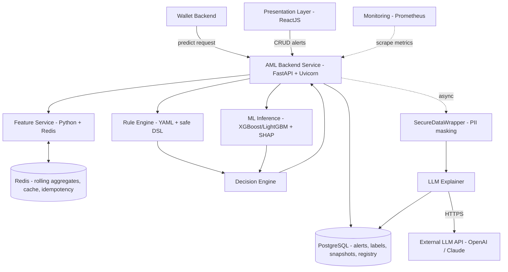
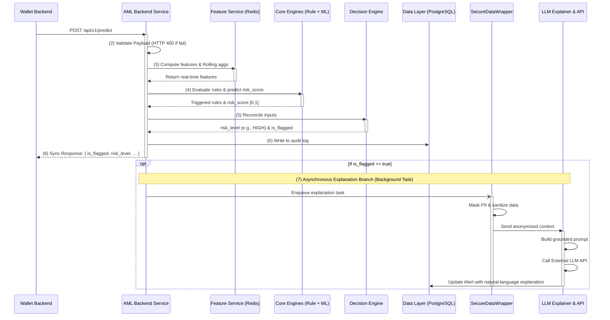

VINUNIVERSITY logo VIN SMART FUTURE logo

# ANOMALYX - TRANSACTION ANOMALY DETECTOR (AML) PROTOTYPE

Technical Design Document

<table>
  <thead>
    <tr>
        <th colspan="2">AnomalyX Team</th>
    </tr>
  </thead>
  <tbody>
    <tr>
        <td>Group members</td>
        <td>Phạm Lê Hoàng Nam - 2A202600416<br/>Đinh Thái Tuấn - 2A202600360<br/>Nguyễn Trọng Tín - 2A202600229</td>
    </tr>
    <tr>
        <td>Mentor</td>
        <td>Trần Quang Hiển (VSF-FINTECH-VDTDVTC)</td>
    </tr>
    <tr>
        <td>Ext Mentor</td>
        <td>Phan Công Huân (VSF-FINTECH-VDTDVTC)<br/>Nguyễn Nam Trường (VSF-FINTECH-VDTDVTC)</td>
    </tr>
  </tbody>
</table>

– HaNoi, May 2026 –

1 | Page

# Table of Contents

**I. Record of Changes** 4
**II. Technical Design Document** 5

1. System Architecture 5
   1.1. System Architecture Overview 5
   1.2. System Architecture Explanation 5
   1.3. Real-time Scoring Flow 6
   1.4. Decision Logic (Rule + ML Reconciliation) 7
   1.4.1. Overview 7
   1.4.2. Precedence Policy & Reconciliation Strategy 7
   1.4.3. Decision Matrix (Truth Table) 7
   1.5. Deployment View 8
   1.5.1. Overview 8
   1.5.2. External Integration & Security Configuration 8
2. Data design 9
   2.1 Transaction Input Schema 9
   2.2 Alert & Label Schema 9
   2.3 Persistence Design 10
   2.4 Model Training Dataset 10
   2.5 Privacy & PII 10
3. Feature Engineering Design 11
   3.1 Feature Catalog 11
   3.2 Computation Strategy 11
4. Rule Engine Design 11
   4.1. Rule Schema 11
   4.2. Evaluation & Hot-reload 12
   4.3. Initial Rule Set 12
5. Machine Learning Pipeline Design 12
   5.1 Problem Framing 12
   5.2 Pipeline DAG 12
   5.3 Models & Rationale 12
   5.4 Class-Imbalance Handling 13
   5.5 Calibration & Explainability 13
   5.6 Inference & Model Registry 13
6. API Design 13
   6.1 Conventions 13
   6.2 Endpoints 13
   6.3 Error Handling 14
7. LLM Explainer Design 14
   7.1 Inputs & Prompt 14
   7.2 Asynchrony, Caching & Fallback 14
   7.3 Groundedness Guardrail 14

2 | Page

8. Observability & Operations 14
9. Testing Strategy 15
10. Metric Lock (W2 HARD Gate) 15
11. Traceability & Resolved Open Questions 16
12. Appendix — Glossary (delta) 17

## List of Tables

Table 1. Record of Change 4
Table 2. Component responsibilities 6
Table 3. Precedence and Threshold Matrix 8
Table 4. Transaction input schema 9
Table 5. Alert and review-label schema 10
Table 6. Synthetic dataset scale & schema 10
Table 7. Feature catalog (representative) 11
Table 8. Initial rule set (thresholds N, X, k tuned on the validation set) 12
Table 9. API surface 13
Table 10. Test level 15
Table 11. Locked success metrics 16
Table 12. Requirement/risk traceability 16
Table 13. Glossary (terms new to the TDD) 17

## List of Figures

Figure 1. Component and Data-flow Architecture Diagram 5
Figure 2. Real-time /predict request flow, including the asynchronous explanation branch. 6

3 | Page

# I. Record of Changes

\*A - Added M - Modified D - Deleted

<table>
  <thead>
    <tr>
        <th>Date</th>
        <th>A*<br/>M,<br/>D</th>
        <th>In charge</th>
        <th>Change Description</th>
    </tr>
  </thead>
  <tbody>
    <tr>
        <td>01/06/2026</td>
        <td>A</td>
        <td>NamPLH</td>
        <td>Initialise TDD skeleton; import design goals from PRD.</td>
    </tr>
    <tr>
        <td>02/06/2026</td>
        <td>A</td>
        <td>All members</td>
        <td>Add system architecture, data &amp; feature design, rule engine, ML pipeline.</td>
    </tr>
    <tr>
        <td>03/06/2026</td>
        <td>M</td>
        <td>All members</td>
        <td>Add API design, LLM explainer, testing strategy; lock success metrics.</td>
    </tr>
    <tr>
        <td> </td>
        <td> </td>
        <td> </td>
        <td> </td>
    </tr>
    <tr>
        <td> </td>
        <td> </td>
        <td> </td>
        <td> </td>
    </tr>
  </tbody>
</table>

Table 1. Record of Change

4 | Page

# II. Technical Design Document

# 1. System Architecture

## 1.1. System Architecture Overview

**AnomalyX** uses a hybrid, layered pipeline. A deterministic rule engine captures known AML typologies with high precision; a gradient-boosted ML classifier captures complex, uncodified anomalies; a decision engine reconciles both into a single action; and an asynchronous LLM layer produces a grounded natural-language explanation for each alert. All components run as a single Docker Compose stack.



Figure 1. Component and Data-flow Architecture Diagram

## 1.2. System Architecture Explanation

<table>
  <thead>
    <tr>
        <th>Component</th>
        <th>Responsibility</th>
        <th>Key tech</th>
    </tr>
  </thead>
  <tbody>
    <tr>
        <td>AML Backend Service</td>
        <td>Request validation, auth (JWT), routing, API contract, CRUD operations for Alerts (serving the React dashboard), and error handling.</td>
        <td>FastAPI + Uvicorn</td>
    </tr>
    <tr>
        <td>Presentation Layer</td>
        <td>Interactive web dashboard for Compliance Officers to monitor alerts, review LLM explanations, and update transaction statuses,...</td>
        <td>ReactJS</td>
    </tr>
    <tr>
        <td>Monitoring</td>
        <td>Scrapes and stores system health, API latency, and business metrics (e.g., alert rate, model drift) via Exporters.</td>
        <td>Prometheus Server</td>
    </tr>
    <tr>
        <td>Feature Service</td>
        <td>Compute transaction-, velocity- and behavioural features from the payload and rolling aggregates.</td>
        <td>Python, Redis</td>
    </tr>
    <tr>
        <td>Rule Engine</td>
        <td>Evaluate the YAML rule set over features; emit triggered rules with severity; support hot-reload.</td>
        <td>Custom YAML + safe DSL</td>
    </tr>
    <tr>
        <td>ML Inference</td>
        <td>Load the serialized, calibrated model and return risk_score ∈ [0,1] plus SHAP top-k.</td>
        <td>XGBoost / LightGBM, SHAP</td>
    </tr>
    <tr>
        <td>Decision Engine</td>
        <td>Reconciles rule severity and ML risk_score into the final risk_level (LOW, MEDIUM, HIGH, CRITICAL); sets is_flagged = true only for HIGH and CRITICAL.</td>
        <td>Python</td>
    </tr>
  </tbody>
</table>

5 | Page

<table>
  <thead>
    <tr>
        <th>Component</th>
        <th>Responsibility</th>
        <th>Key tech</th>
    </tr>
  </thead>
  <tbody>
    <tr>
        <td>SecureDataWrapper</td>
        <td>Masks or hashes Personally Identifiable Information (PII) such as account numbers and user IDs before injecting data into the prompt.</td>
        <td>Python (Data Masking)</td>
    </tr>
    <tr>
        <td>LLM Explainer</td>
        <td>Asynchronously build a grounded prompt and produce a bilingual explanation; cache; fallback to template.</td>
        <td>OpenAI/Anthropic SDK</td>
    </tr>
    <tr>
        <td>Data Layer</td>
        <td>PostgreSQL: Stores alerts, review labels, feature snapshots, rule versions, and model registry.<br/>Redis: Serves real-time rolling aggregates and high-speed caches.</td>
        <td>PostgreSQL + Redis</td>
    </tr>
    <tr>
        <td>External Service</td>
        <td>Provides the foundational large language models for reasoning and generating human-readable explanations via API endpoints.</td>
        <td>OpenAI API, Claude API</td>
    </tr>
  </tbody>
</table>

Table 2. Component responsibilities

## 1.3. Real-time Scoring Flow



Figure 2. Real-time /predict request flow, including the asynchronous explanation branch.

**Step summary:**

1. The **Wallet Backend** calls POST /api/v1/predict

2. The **AML Backend Service** validates the payload; malformed input returns HTTP 400

3. The **Feature Service** computes features from the transaction and synchronizes with Redis to fetch/update the sender's rolling aggregates (e.g., 1h/24h velocity)

4. The **Rule Engine** and **ML Inference** run logically in parallel using the extracted features to produce triggered rules and a probabilistic risk_score

5. The **Decision Engine** combines these inputs via the precedence policy to determine the risk_level (e.g., LOW, MEDIUM, HIGH, CRITICAL) and is_flagged status, returning them along with the score, triggered rules, and top features

6 | Page

6. Logging & Sync Response: Every evaluation result is immediately written to the PostgreSQL audit log. The synchronous response is then returned to the **Wallet Backend**.

7. Asynchronous Branch (LLM Explanation): If <mark>is_flagged</mark> is true, an alert is persisted in the database and a background explanation task is enqueued. The **SecureDataWrapper** first processes the flagged transaction to mask any PII, passing only the anonymized context to the **LLM Explainer**. The Explainer then builds the grounded prompt, calls the **External API**, and updates the database alert with the natural-language explanation.

## 1.4. Decision Logic (Rule + ML Reconciliation)

### 1.4.1. Overview

The Decision Engine acts as the final arbiter of the system. It is responsible for reconciling the deterministic outputs from the Rule Engine (triggered rule codes and their severities) with the probabilistic output from the ML Inference (`risk_score` ranging from 0.0 to 1.0). This hybrid approach ensures that the system can catch known, hard-coded money laundering patterns while also detecting subtle, unseen anomalous behaviors.

### 1.4.2. Precedence Policy & Reconciliation Strategy

_Precedence Policy & Reconciliation Strategy:_ To resolve conflicts between the Rule Engine and the ML model, the Decision Engine applies a **Precedence and Threshold Matrix**. The core philosophy is that deterministic legal/compliance constraints always override probabilistic predictions, while ML scores serve to elevate the risk of otherwise borderline transactions. The reconciliation logic follows these ordered principles:

1. **Absolute Override (Critical Rules)**: If a transaction triggers any rule with a <mark>CRITICAL</mark> severity (e.g., presence on a Sanctions/Blacklist, or violating a hard regulatory limit), the transaction is immediately classified as <mark>CRITICAL</mark> and flagged, regardless of how low the ML <mark>risk_score</mark> is.

2. **Score-Based Elevation**: If no critical rules are triggered, the system evaluates the ML risk_score against predefined thresholds. A high ML score can independently elevate a transaction to HIGH even if the Rule Engine found nothing suspicious.

3. **Cumulative Suspicion**: Minor rule violations (e.g., unusual time of day) combined with a moderate ML score will push the transaction into the MEDIUM (Suspicious) category.

### 1.4.3. Decision Matrix (Truth Table)

The following matrix defines how the final risk_level and is_flagged status are calculated based on the combined inputs:

<table>
  <thead>
    <tr>
        <th>Rule Engine Output</th>
        <th>ML Inference Output<br/>(risk_score)</th>
        <th>Final<br/>risk_level</th>
        <th>is_flagged</th>
        <th>Operational Meaning</th>
    </tr>
  </thead>
  <tbody>
    <tr>
        <td><strong>CRITICAL</strong> Rule Triggered</td>
        <td>Any score</td>
        <td>CRITICAL</td>
        <td><strong>True</strong></td>
        <td>Absolute compliance violation (e.g., sanctions/blacklist hit, hard regulatory limit). LLM explains the hard rule breach.</td>
    </tr>
    <tr>
        <td><strong>HIGH</strong> Rule Triggered</td>
        <td>Any score</td>
        <td>HIGH</td>
        <td><strong>True</strong></td>
        <td>Clear AML pattern (e.g., structuring). Alert generated.</td>
    </tr>
    <tr>
        <td>None or MINOR Rule</td>
        <td>risk_score &gt;= 0.70</td>
        <td>HIGH</td>
        <td><strong>True</strong></td>
        <td>ML model detects strongly anomalous behavior. Alert generated.</td>
    </tr>
    <tr>
        <td><strong>MINOR</strong> Rule Triggered</td>
        <td>0.40 &lt;= risk_score &lt; 0.70</td>
        <td>MEDIUM</td>
        <td>False</td>
        <td>Suspicious but lacks concrete evidence. Log-only for background monitoring (no alert).</td>
    </tr>
    <tr>
        <td>None</td>
        <td>0.40 &lt;= risk_score &lt; 0.70</td>
        <td>MEDIUM</td>
        <td>False</td>
        <td>Slight ML deviation. Log-only for background monitoring (no alert).</td>
    </tr>
    <tr>
        <td>None or MINOR Rule</td>
        <td>risk_score &lt; 0.40</td>
        <td>LOW</td>
        <td>False</td>
        <td>Normal transaction. Proceed without interruption.</td>
    </tr>
  </tbody>
</table>

_Note: The ML thresholds (0.40 and 0.70) are configurable via environment variables and can be calibrated by the Risk/Data Science team without requiring a system rebuild._

Table 3. Precedence and Threshold Matrix

## 1.5. Deployment View

### 1.5.1. Overview

The entire AnomalyX prototype is fully containerized and orchestrated via Docker Compose. This architecture fulfills the hardware interface requirements by ensuring a seamless, single-command startup (`docker-compose up`) **(HI-01)** and operates entirely on standard CPUs without requiring specialized GPU acceleration **(HI-02)**.

- aml-api (AML Backend Service): Runs the FastAPI/Uvicorn server following a modular monolith approach to reduce deployment complexity. It loads the serialized ML model and YAML rule set into memory at startup to handle real-time scoring. Additionally, it utilizes FastAPI's built-in BackgroundTasks to asynchronously execute the **SecureDataWrapper** and **LLM Explainer** logic within the same service, ensuring the main scoring thread is never blocked.

- aml-frontend (Presentation Layer): Serves the ReactJS/Vite application, providing the interactive compliance dashboard for end-users.

- postgres (Relational Database): The persistent data layer storing alerts, review labels, feature snapshots, rule versions, and the model registry.

- redis (In-Memory Datastore): Acts as the message broker for the background worker, maintains real-time rolling aggregates (e.g., per-sender velocity) for the Feature Service, and handles idempotency keys.

- monitoring (Observability Stack): Runs Prometheus to scrape /metrics from the API and Worker containers, optionally bundled with Grafana for visual dashboards of system health and model drift.

### 1.5.2. External Integration & Security Configuration

The system communicates with external LLM providers (e.g., OpenAI, Anthropic) exclusively over secure HTTPS protocols. Adhering to strict security hygiene **(SEC-02)**, all sensitive credentials, database passwords, and LLM sandbox API keys are dynamically injected into the containers via a .env file, ensuring no secrets are hardcoded in the source code repository.

8 | Page

# 2. Data design

## 2.1 Transaction Input Schema

The `<mark>/api/v1/predict</mark>` payload is the canonical input contract. Identifiers are pseudonymous (hashed upstream); no raw PII is accepted or stored. To ensure compatibility with the ML model trained on the PaySim dataset, the payload must include account balance snapshots at the time of the transaction.

<table>
  <thead>
    <tr>
        <th>Field</th>
        <th>Type</th>
        <th>Description</th>
    </tr>
  </thead>
  <tbody>
    <tr>
        <td>transaction_id</td>
        <td>string (UUID)</td>
        <td>Unique transaction identifier; used as idempotency key.</td>
    </tr>
    <tr>
        <td>sender_id</td>
        <td>string (hash)</td>
        <td>HMAC-SHA256 pseudonymous identifier<br/>(nameOrig in PaySim).</td>
    </tr>
    <tr>
        <td>receiver_id</td>
        <td>string (hash)</td>
        <td>HMAC-SHA256 pseudonymous identifier<br/>(nameDest in PaySim).</td>
    </tr>
    <tr>
        <td>sender_balance</td>
        <td>number</td>
        <td>Sender's wallet balance exactly before the transaction.</td>
    </tr>
    <tr>
        <td>receiver_balance</td>
        <td>number</td>
        <td>Receiver's wallet balance exactly before the transaction.</td>
    </tr>
    <tr>
        <td>amount</td>
        <td>number</td>
        <td>Transaction amount; non-negative.</td>
    </tr>
    <tr>
        <td>currency</td>
        <td>string</td>
        <td>ISO 4217; default VND.</td>
    </tr>
    <tr>
        <td>timestamp</td>
        <td>string (ISO-8601)</td>
        <td>Event time<br/>(Mapped to PaySim's step during ML inference).</td>
    </tr>
    <tr>
        <td>channel</td>
        <td>enum</td>
        <td>PAYMENT | TRANSFER | CASH_OUT | CASH_IN | DEBIT</td>
    </tr>
    <tr>
        <td>device_id</td>
        <td>string (optional)</td>
        <td>Optional device/hardware identifier for anomaly detection; backward-compatible.<br/>Omit if device evidence is unavailable.</td>
    </tr>
    <tr>
        <td>location_country</td>
        <td>string (optional, ISO 3166-1 alpha-2)</td>
        <td>Optional 2-letter country code for geo anomaly detection; backward-compatible.<br/>Omit if geo evidence is unavailable.</td>
    </tr>
    <tr>
        <td>location_region</td>
        <td>string (optional)</td>
        <td>Optional region/province/city code or name; backward-compatible.<br/>Omit if geo evidence is unavailable.</td>
    </tr>
  </tbody>
</table>

Table 4. Transaction input schema

Example payload:

```json
{
  "transaction_id": "8f1c...e9",
  "sender_id": "h:3a9f...",
  "receiver_id": "h:7b2c...",
  "sender_balance": 15000000,
  "receiver_balance": 200000,
  "amount": 9500000,
  "currency": "VND",
  "timestamp": "2026-05-30T09:14:03+07:00",
  "channel": "TRANSFER",
  "device_id": "device-demo-001",
  "location_country": "VN",
  "location_region": "HN"
}
```

> **Note:** The optional geo/device fields are accepted but **backward-compatible** — clients may omit them and the system still processes the transaction normally. Prototype support for geo/device anomaly is **partial** (see §4.3).

## 2.2 Alert & Label Schema

Each flagged transaction creates an alert. The reviewer action (escalate/dismiss) writes back a ground-truth label used for future model retraining.

<table>
  <thead>
    <tr>
        <th>Field</th>
        <th>Type</th>
        <th>Description</th>
    </tr>
  </thead>
  <tbody>
    <tr>
        <td>alert_id</td>
        <td>string</td>
        <td>Primary key.</td>
    </tr>
    <tr>
        <td>transaction_id</td>
        <td>string</td>
        <td>Reference to the scored transaction.</td>
    </tr>
    <tr>
        <td>risk_score</td>
        <td>float [0,1]</td>
        <td>Calibrated ML probability.</td>
    </tr>
    <tr>
        <td>risk_level</td>
        <td>enum</td>
        <td>LOW | MEDIUM | HIGH | CRITICAL</td>
    </tr>
    <tr>
        <td>is_flagged</td>
        <td>boolean</td>
        <td>Final decision from the Decision Engine.</td>
    </tr>
  </tbody>
</table>

9 | Page

<table>
  <thead>
    <tr>
        <th>Field</th>
        <th>Type</th>
        <th>Description</th>
    </tr>
  </thead>
  <tbody>
    <tr>
        <td>triggered_rules</td>
        <td>array</td>
        <td>Rule ids + severity that fired.</td>
    </tr>
    <tr>
        <td>top_features</td>
        <td>array</td>
        <td>SHAP top-k {name, value, contribution}.</td>
    </tr>
    <tr>
        <td>explanation</td>
        <td>string</td>
        <td>Natural language explanation.</td>
    </tr>
    <tr>
        <td>explanation_source</td>
        <td>enum</td>
        <td>llm | template</td>
    </tr>
    <tr>
        <td>status</td>
        <td>enum</td>
        <td>NEW | ESCALATED | DISMISSED</td>
    </tr>
    <tr>
        <td>reviewer_id</td>
        <td>string</td>
        <td>ID of the compliance officer who reviewed.</td>
    </tr>
    <tr>
        <td>updated_at</td>
        <td>timestamp</td>
        <td>Audit timestamp for status/label changes.</td>
    </tr>
  </tbody>
</table>

Table 5. Alert and review-label schema

## 2.3 Persistence Design

Per PRD §7.4, raw transaction objects are **not** persisted; only the transaction_id, derived (non-PII) features, and prediction results are stored. PostgreSQL holds alerts, review_labels, feature_snapshots, rule_versions, and model_registry. Redis holds per-sender rolling aggregates (sliding windows), idempotency keys (TTL), and the explanation cache keyed by the triggered-rule set and bucketed top features.

## 2.4 Model Training Dataset

Instead of generating purely synthetic data from scratch, the ML model utilizes the publicly available PaySim dataset (a widely accepted financial fraud detection benchmark). The dataset simulates mobile money transactions based on real-world financial logs.

<table>
  <thead>
    <tr>
        <th>Aspect</th>
        <th>Target</th>
        <th>Note</th>
    </tr>
  </thead>
  <tbody>
    <tr>
        <td>Source Data</td>
        <td>PaySim (Kaggle)</td>
        <td>Contains ~6.3 million records.</td>
    </tr>
    <tr>
        <td>Sampling Strategy</td>
        <td>~100,000 - 500,000 rows</td>
        <td>Downsampled for prototype feasibility while maintaining the fraud ratio.</td>
    </tr>
    <tr>
        <td>Suspicious ratio</td>
        <td>~0.1% - 1%</td>
        <td>Highly imbalanced, reflecting real-world AML scenarios.</td>
    </tr>
    <tr>
        <td>Train / Val / Test</td>
        <td>70 / 15 / 15</td>
        <td>Stratified by label; time-aware split to avoid leakage.</td>
    </tr>
    <tr>
        <td>Unique users</td>
        <td>≥ 500,000</td>
        <td>Realistic per-user histories.</td>
    </tr>
  </tbody>
</table>

**Table 6. Training dataset scale (PaySim)**

## 2.5 Privacy & PII

- Sender/receiver/device IDs are HMAC-SHA256 hashes with a per-deployment salt; the system never receives or stores names, phone numbers, or account numbers.

- Logs store only hashed IDs, transaction_id, and prediction results — never raw payloads (SEC-01).

- Only non-PII context (rule ids, feature names/values, decision) is sent to the external LLM provider.

10 | Page

# 3. Feature Engineering Design

## 3.1 Feature Catalog

Features are shared by the rule engine and the ML model and are computed by a single code path used at both training and serving time to eliminate train/serve skew.

<table>
  <thead>
    <tr>
        <th>Group</th>
        <th>Representative features</th>
        <th>Window</th>
        <th>Targets typology</th>
    </tr>
  </thead>
  <tbody>
    <tr>
        <td>Transaction</td>
        <td>log_amount, hour_of_day, is_round_amount,<br/>amount_to_threshold_ratio</td>
        <td>—</td>
        <td>Threshold avoidance</td>
    </tr>
    <tr>
        <td>Velocity</td>
        <td>tx_count_1h/24h/7d, sum_amount_1h/24h,<br/>std_amount</td>
        <td>1h–7d</td>
        <td>Velocity anomaly,<br/>rapid movement</td>
    </tr>
    <tr>
        <td>Counterparty</td>
        <td>distinct_receivers_1h/24h, fan_out, fan_in</td>
        <td>1h–24h</td>
        <td>Smurfing, layering</td>
    </tr>
    <tr>
        <td>Behavioural</td>
        <td>amount_zscore_vs_user,<br/>velocity_vs_baseline_ratio</td>
        <td>user history</td>
        <td>Velocity anomaly</td>
    </tr>
    <tr>
        <td>Sequence</td>
        <td>rapid_inout_flag (in→out within Δt),<br/>chain_depth</td>
        <td>≤ 60 min</td>
        <td>Rapid movement,<br/>layering</td>
    </tr>
    <tr>
        <td>Structuring</td>
        <td>count_just_below_threshold_24h,<br/>sum_just_below</td>
        <td>24h</td>
        <td>Structuring</td>
    </tr>
  </tbody>
</table>

Table 7. Feature catalog (representative)

## 3.2 Computation Strategy

At serving time, per-sender rolling aggregates are maintained incrementally in Redis (sliding-window counters and sums) so that feature lookup is O(1) and fits the 500 ms budget. Cold-start senders fall back to neutral defaults flagged by a has_history indicator. In batch mode, identical features are recomputed deterministically from the store. Fixed random seeds and pinned feature code guarantee reproducibility (MAI-01).

# 4. Rule Engine Design

## 4.1 Rule Schema

Rules are declarative YAML over the feature dictionary. A rule has an id, the typology it targets, a boolean condition expressed in a restricted DSL, a severity, an action hint, and an enabled flag. Conditions are evaluated with a sandboxed expression evaluator (no arbitrary code, whitelisted operators/feature names) for safety.

```yaml
version: 3
rules:
  - id: R-STRUCT-01
    typology: structuring
    severity: HIGH
    enabled: true
    window: 24h
    condition: "count_just_below_threshold_24h >= 3 and amount < 400_000_000"
    action_hint: FLAG
  - id: R-VELO-01
    typology: velocity_anomaly
    severity: MEDIUM
    condition: "velocity_vs_baseline_ratio > 10"
    action_hint: FLAG
```

11 | Page

## 4.2. Evaluation & Hot-reload

On startup or reload, the YAML is parsed, schema-validated (unique ids, known feature names, parseable conditions), compiled into callables, and atomically swapped into memory. Per PRD §4.1.5, an invalid file is rejected: the engine logs detailed errors, notifies the engineer, and keeps the previous valid rule set so the service never serves a broken configuration. Reload is triggered by POST /api/v1/rules/reload (ML/Risk Engineer, JWT-protected).

## 4.3. Initial Rule Set

At least six rules ship in v1 (PRD §6.2), one per injected typology, giving full rule coverage of the synthetic positives.

<table>
  <thead>
    <tr>
        <th>Rule id</th>
        <th>Typology</th>
        <th>Condition (informal)</th>
        <th>Severity</th>
    </tr>
  </thead>
  <tbody>
    <tr>
        <td>R-STRUCT-01</td>
        <td>Structuring</td>
        <td>≥3 transactions just below 400M VND<br/>within 24h</td>
        <td>HIGH</td>
    </tr>
    <tr>
        <td>R-SMURF-01</td>
        <td>Smurfing</td>
        <td>distinct_receivers_1h ≥ N and<br/>sum_amount_1h ≥ X</td>
        <td>HIGH</td>
    </tr>
    <tr>
        <td>R-RAPID-01</td>
        <td>Rapid movement</td>
        <td>in→out within 60 min, repeated ≥ k times</td>
        <td>HIGH</td>
    </tr>
    <tr>
        <td>R-LAYER-01</td>
        <td>Layering</td>
        <td>chain_depth ≥ 3 with near-equal amounts</td>
        <td>MEDIUM</td>
    </tr>
    <tr>
        <td>R-VELO-01</td>
        <td>Velocity anomaly</td>
        <td>velocity_vs_baseline_ratio &gt; 10</td>
        <td>MEDIUM</td>
    </tr>
    <tr>
        <td>R-GEO-01</td>
        <td>Geo/device anomaly</td>
        <td>geo/device evidence available and (new_device<br/>or geo anomaly or impossible travel)</td>
        <td>MEDIUM</td>
    </tr>
  </tbody>
</table>

Table 8. Initial rule set (thresholds N, X, k tuned on the validation set)

> **Geo/device implementation status (prototype):** The `device_id`, `location_country`, and `location_region` fields are **optional** and backward-compatible. The current prototype does **not** maintain per-user device/location history or Redis rolling aggregates; therefore all geo/device proxy features default to `False`. Rule `R-GEO-01` will only fire after a historical profile or Redis-backed aggregate service is implemented. Without those, sending geo/device fields alone does **not** create risk. This is a **partial implementation** — the schema and pipeline accept the input, but true geo/device anomaly detection requires the future aggregate/Redis layer.

# 5. Machine Learning Pipeline Design

## 5.1 Problem Framing

Supervised binary classification (suspicious vs. legitimate) under extreme class imbalance. Because positives are rare, accuracy is uninformative; the primary optimisation and reporting metric is PR-AUC, with the operating point chosen to meet the recall floor at the required precision.

## 5.2 Pipeline DAG

generate → validate → feature_extract → split (stratified, time-aware) → preprocess → train → evaluate → calibrate → serialize → register.

The DAG is reproducible end-to-end from a single Makefile target with pinned seeds and a hashed data manifest (MAI-01).

## 5.3 Models & Rationale

- **Baseline:** Logistic Regression with class weighting — an interpretable reference and sanity check.

- **Primary:** gradient-boosted trees (XGBoost / LightGBM) — strong on tabular, heterogeneous, non-linear features; fast CPU inference within the latency budget; native feature importance; no GPU required (HI-02).

12 | Page

## 5.4 Class-Imbalance Handling

Use scale_pos_weight / class weights as the primary lever; optionally apply SMOTE on the training fold only (never on val/test) to avoid leakage; tune the decision threshold on the validation set to hit recall ≥ 0.60 at precision ≥ 0.70; evaluate with PR-AUC rather than accuracy. SMOTE is used cautiously per PRD risk R4 and only if it improves validation PR-AUC.

## 5.5 Calibration & Explainability

Probabilities are calibrated (Platt or isotonic on the validation fold) so risk_score is a meaningful probability against which the configurable decision thresholds τ_medium = 0.40 and τ_flag = 0.70 (see Table 3) classify alerts into LOW / MEDIUM / HIGH; the CRITICAL level is reserved for CRITICAL-severity rule hits. Per-prediction explainability uses SHAP (TreeExplainer) to surface the top-k contributing features (EXP-02); these feed both the alert payload and the LLM prompt. Permutation importance provides a global view for the model card.

## 5.6 Inference & Model Registry

The serialized, calibrated model plus its preprocessing are loaded at API startup and executed in-process for minimum latency. Each trained artifact is versioned in the model registry with its metrics, the training-data hash, the feature list, and the locked thresholds, accompanied by a model card.

# 6. API Design

## 6.1 Conventions

- Base path /api; JSON request/response; OpenAPI 3.0 contract (SI-01) with an explicit versioning strategy (SI-04).

- JWT bearer auth on protected endpoints (SI-03); the Wallet Backend uses a service token.

- Idempotency: the transaction_id (or an Idempotency-Key header) deduplicates retries; a repeated key returns the original decision.

- Uniform error envelope: { error: { code, message, details } }.

## 6.2 Endpoints

<table>
  <thead>
    <tr>
        <th>Method &amp; path</th>
        <th>Actor</th>
        <th>Purpose</th>
    </tr>
  </thead>
  <tbody>
    <tr>
        <td>POST /api/v1/predict</td>
        <td>Wallet Backend</td>
        <td>Real-time scoring → risk_level + is_flagged + score<br/>+ rules + features.</td>
    </tr>
    <tr>
        <td>POST /api/v1/batch-score</td>
        <td>Compliance Officer</td>
        <td>Score a time window; build the alert list<br/>(UC-02).</td>
    </tr>
    <tr>
        <td>GET /api/v1/alerts</td>
        <td>Compliance Officer</td>
        <td>List/filter alerts (by status, score, date).</td>
    </tr>
    <tr>
        <td>GET /api/v1/alerts/{id}</td>
        <td>Compliance Officer</td>
        <td>Alert detail incl. explanation (UC-03).</td>
    </tr>
    <tr>
        <td>PATCH /api/v1/alerts/{id}/status</td>
        <td>Compliance Officer</td>
        <td>Escalate/Dismiss → writes ground-truth<br/>label (UC-04).</td>
    </tr>
    <tr>
        <td>POST /api/v1/rules/reload</td>
        <td>ML/Risk Engineer</td>
        <td>Validate &amp; hot-reload the rule set (UC-05).</td>
    </tr>
    <tr>
        <td>GET /api/v1/rules</td>
        <td>ML/Risk Engineer</td>
        <td>Return the active rule configuration.</td>
    </tr>
    <tr>
        <td>GET /health · GET /metrics</td>
        <td>Monitoring</td>
        <td>Liveness/readiness · Prometheus metrics<br/>(UC-06).</td>
    </tr>
  </tbody>
</table>

Table 9. API surface

13 | Page

Example — POST /api/v1/predict response:

```json
{
  "transaction_id": "8f1c...e9",
  "risk_level": "HIGH",
  "is_flagged": true,
  "risk_score": 0.83,
  "triggered_rules": [{ "id": "R-STRUCT-01", "severity": "HIGH" }],
  "top_features": [
    {
      "name": "count_just_below_threshold_24h",
      "value": 4,
      "contribution": 0.31
    },
    { "name": "velocity_vs_baseline_ratio", "value": 7.2, "contribution": 0.18 }
  ],
  "explanation": null, // filled asynchronously
  "alert_id": "al_00921"
}
```

## 6.3 Error Handling

Malformed/incomplete payloads return HTTP 400 with field-level details (REL-01); auth failures return 401/403. If the external LLM is unavailable, /predict and alert endpoints still return the decision and triggered-rule codes without the natural-language text (PRD 4.1.1/4.1.3), and explanation_source is set to template.

# 7. LLM Explainer Design

## 7.1 Inputs & Prompt

The explainer receives only the triggered rules (id, name, why), the SHAP top-k features (name, value, contribution), the decision, and non-PII transaction context. The system prompt constrains the model to be grounded — it may reference only the supplied rules and features — and to produce a concise, bilingual (Vietnamese/English) explanation understandable to non-technical compliance staff (EXP-01).

```
SYSTEM: You are an AML analyst assistant. Explain why this transaction
was flagged using ONLY the rules and features provided. Do not invent
facts, amounts, or identifiers. Be concise; audience = non-technical.
USER: risk_level=HIGH; is_flagged=true; rules=[R-STRUCT-01: structuring];
      features=[count_just_below_threshold_24h=4, velocity_vs_baseline=7.2]
```

## 7.2 Asynchrony, Caching & Fallback

Resolving PRD risk R3, the explanation is produced by a background worker after the decision is returned, so it never sits on the request path. Explanations are cached keyed by the sorted triggered-rule set and bucketed top features; cache hits are near-instant. The end-to-end p95 with explanation stays ≤ 3 s (service metric). On timeout or provider error, the system falls back to a deterministic template listing the triggered rule codes and top features, tagged explanation_source = template.

## 7.3 Groundedness Guardrail

A post-generation check verifies the explanation references only supplied rule ids/feature names; outputs introducing unsupported specifics are rejected and replaced by the template. Groundedness is part of the W5 qualitative review (≥20 sample alerts).

# 8. Observability & Operations

- **Logging**: structlog JSON with request_id, transaction_id, decision, latency_ms, model_version, rule_version — hashed IDs only, no raw PII (SEC-01, MAI-02).

14 | Page

- **Metrics**: Prometheus — request_count, request_latency histogram (p50/p95/p99), decisions_total{decision}, rule_trigger_total{rule_id}, llm_latency, llm_fallback_total, score histogram, and a drift gauge (PSI).

- **Health**: /health liveness; readiness verifies model loaded, rules loaded, and DB reachable.

- **Drift**: PSI/KS on feature and score distributions over time; threshold breach raises an alert to the engineer (UC-06).

# 9. Testing Strategy

<table>
  <thead>
    <tr>
        <th>Level</th>
        <th>What it verifies</th>
        <th>Tooling</th>
    </tr>
  </thead>
  <tbody>
    <tr>
        <td>Unit</td>
        <td>Feature functions, rule evaluation/DSL, decision logic, schema validation.</td>
        <td>pytest</td>
    </tr>
    <tr>
        <td>Integration</td>
        <td>API + Postgres + Redis + rule engine + model wired together.</td>
        <td>pytest + test containers</td>
    </tr>
    <tr>
        <td>End-to-end</td>
        <td>Synthetic tx → decision → alert → status update → label.</td>
        <td>pytest</td>
    </tr>
    <tr>
        <td>ML validation</td>
        <td>Held-out test metrics meet the locked thresholds; reproducibility (seed → same metrics).</td>
        <td>pytest + sklearn</td>
    </tr>
    <tr>
        <td>Rule coverage</td>
        <td>Golden transactions per typology trigger the expected rules.</td>
        <td>pytest fixtures</td>
    </tr>
    <tr>
        <td>Performance</td>
        <td>50 req/s sustained; p95 &lt; 500 ms excl. LLM (PER-01/03).</td>
        <td>Locust / k6</td>
    </tr>
    <tr>
        <td>Contract</td>
        <td>Responses conform to the OpenAPI 3.0 schema.</td>
        <td>schemathesis</td>
    </tr>
  </tbody>
</table>

Table 10. Test level

Target test coverage is ≥ 70% across core modules — feature engineering, rule engine, and prediction (service metric). ML validation tunes thresholds on the validation fold only; no test-set leakage is permitted.

# 10. Metric Lock (W2 HARD Gate)

Per PRD risk R7, the success metrics below are frozen at W2 and become the acceptance criteria from W3 onward. PR-AUC is the primary model metric given the imbalance.

<table>
  <thead>
    <tr>
        <th>Metric</th>
        <th>Target</th>
        <th>Measurement</th>
    </tr>
  </thead>
  <tbody>
    <tr>
        <td>Precision (suspicious)</td>
        <td>≥ 0.70</td>
        <td>Test set at the locked operating threshold.</td>
    </tr>
    <tr>
        <td>Recall (suspicious)</td>
        <td>≥ 0.60</td>
        <td>Test set at the locked operating threshold.</td>
    </tr>
    <tr>
        <td>F1 (suspicious)</td>
        <td>≥ 0.65</td>
        <td>Harmonic mean at the operating point.</td>
    </tr>
    <tr>
        <td>PR-AUC (primary)</td>
        <td>≥ 0.50</td>
        <td>Threshold-independent; primary under imbalance.</td>
    </tr>
    <tr>
        <td>AUC-ROC</td>
        <td>≥ 0.85</td>
        <td>Separability check.</td>
    </tr>
    <tr>
        <td>Model false-positive rate</td>
        <td>≤ 5%</td>
        <td>On legitimate transactions only.</td>
    </tr>
    <tr>
        <td>Rule false-positive rate</td>
        <td>≤ 8%</td>
        <td>On legitimate transactions only.</td>
    </tr>
    <tr>
        <td>Service p95 (excl. LLM)</td>
        <td>≤ 500 ms</td>
        <td>/predict load test at 50 req/s.</td>
    </tr>
    <tr>
        <td>Service p95 (incl. LLM)</td>
        <td>≤ 3 s</td>
        <td>Async path with cache.</td>
    </tr>
    <tr>
        <td>Throughput</td>
        <td>≥ 50 req/s</td>
        <td>Single instance.</td>
    </tr>
    <tr>
        <td>Test coverage</td>
        <td>≥ 70%</td>
        <td>Core modules.</td>
    </tr>
  </tbody>
</table>

15 | Page

<table>
  <thead>
    <tr>
        <th>Metric</th>
        <th>Target</th>
        <th>Measurement</th>
    </tr>
  </thead>
  <tbody>
    <tr>
        <td>LLM groundedness</td>
        <td>100% supported</td>
        <td>≥20-sample qualitative review (W5).</td>
    </tr>
  </tbody>
</table>

Table 11. Locked success metrics

**Locked configuration constants:** CTR / large-value reporting threshold = 400,000,000 VND (Decision 11/2023/QĐ-TTg); decision thresholds τ<sub>medium</sub> and τ<sub>flag</sub> are set on the validation fold to satisfy the recall/precision targets and recorded in the model registry.

# 11. Traceability & Resolved Open Questions

Design-level resolutions to the PRD risks and open questions:

<table>
  <thead>
    <tr>
        <th>PRD item</th>
        <th>Resolution in this TDD</th>
    </tr>
  </thead>
  <tbody>
    <tr>
        <td>R3 — LLM latency/cost</td>
        <td>Async explanation + caching (§7.2); removed from request path.</td>
    </tr>
    <tr>
        <td>R4 — class imbalance</td>
        <td>scale_pos_weight, careful SMOTE on train only, PR-AUC, threshold tuning (§5.4).</td>
    </tr>
    <tr>
        <td>R5 — rule/ML conflict</td>
        <td>Decision precedence: rule hit ⇒ HIGH/CRITICAL flagged; ML escalates/ranks (§1.4).</td>
    </tr>
    <tr>
        <td>R7 — late metrics</td>
        <td>Metrics locked here at W2 (§10).</td>
    </tr>
    <tr>
        <td>OQ — CTR threshold</td>
        <td>Use the legal value 400M VND (Decision 11/2023/QĐ-TTg).</td>
    </tr>
    <tr>
        <td>OQ — explanation language</td>
        <td>Bilingual Vietnamese/English (§7.1).</td>
    </tr>
    <tr>
        <td>OQ — LLM provider</td>
        <td>Provider-agnostic client (OpenAI/Anthropic/local) via .env; configurable.</td>
    </tr>
    <tr>
        <td>OQ — W6 demo surface</td>
        <td>Minimal React dashboard + API/CLI demo.</td>
    </tr>
  </tbody>
</table>

Table 12. Requirement/risk traceability

16 | Page

# 12. Appendix — Glossary (delta)

<table>
  <thead>
    <tr>
        <th>Term</th>
        <th>Definition</th>
    </tr>
  </thead>
  <tbody>
    <tr>
        <td>PR-AUC</td>
        <td>Area under the precision–recall curve; primary metric under class imbalance.</td>
    </tr>
    <tr>
        <td>Calibration</td>
        <td>Adjusting raw model outputs so scores behave as true probabilities.</td>
    </tr>
    <tr>
        <td>scale_pos_weight</td>
        <td>Gradient-boosting parameter up-weighting the minority (positive) class.</td>
    </tr>
    <tr>
        <td>PSI</td>
        <td>Population Stability Index; quantifies distribution drift over time.</td>
    </tr>
    <tr>
        <td>Idempotency</td>
        <td>Repeated identical requests yield the same result without side effects.</td>
    </tr>
    <tr>
        <td>DSL</td>
        <td>Domain-specific language; here, the restricted rule-condition syntax.</td>
    </tr>
    <tr>
        <td>Model card</td>
        <td>Document recording a model's data, metrics, thresholds and intended use.</td>
    </tr>
    <tr>
        <td>SHAP</td>
        <td>SHapley Additive exPlanations; per-prediction feature attributions.</td>
    </tr>
  </tbody>
</table>

**Table 13. Glossary (terms new to the TDD)**

17 | Page
